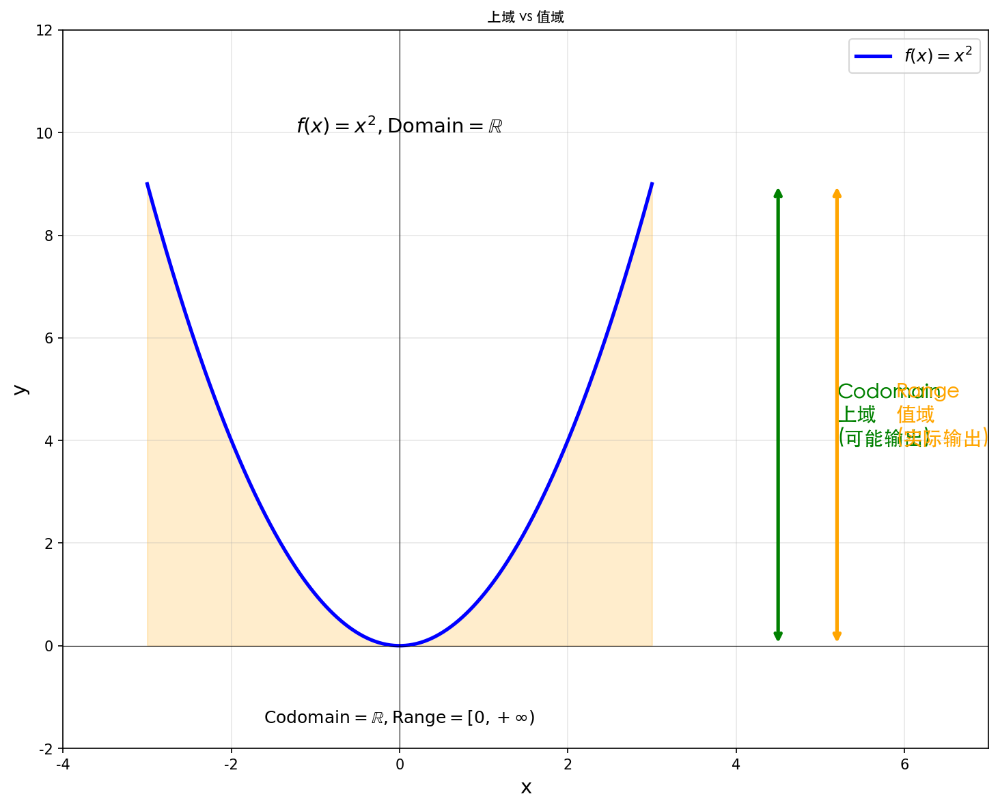
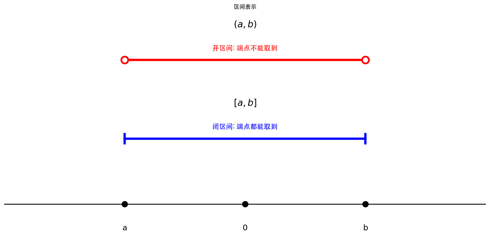
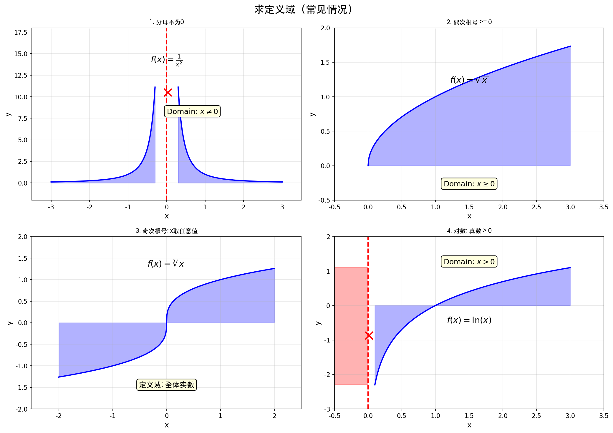
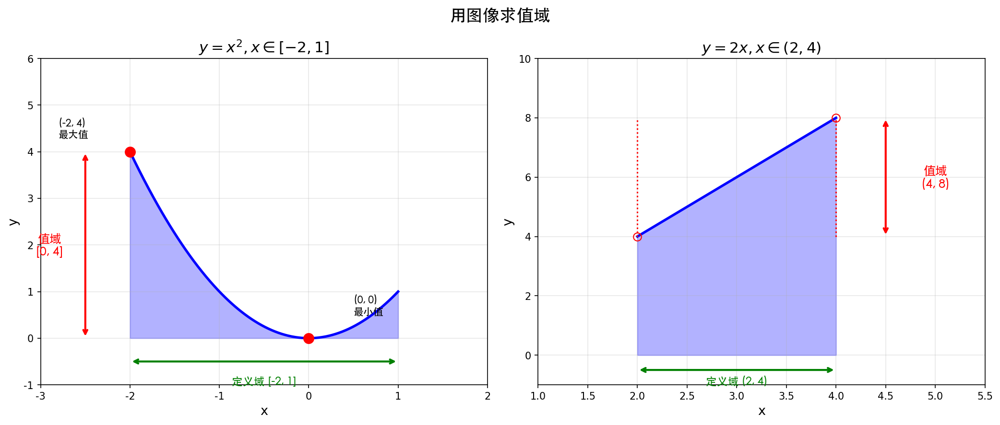
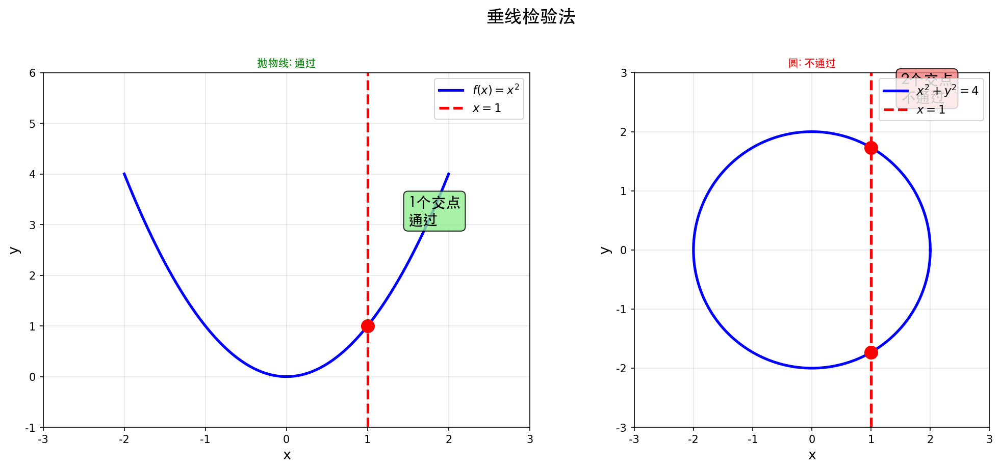
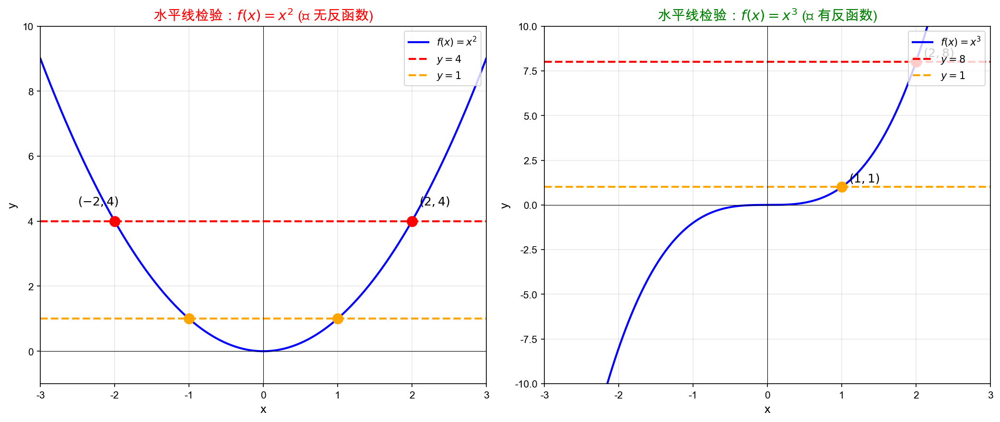

## 基本概念

### 定义
把一个对象转化成另一个对象的规则，包含**定义域**、**转换规则**和**上域或值域**三部分。

### 函数本质
- 函数是**转换规则**
- $f$ 是函数，$f(x)$ 带自变量
- 说 $f(x)$ 是函数不太贴切

### 判断函数相同
定义域和对应规则都要相同。
- 例如：$y=x$ 与 $y=\frac{x^2}{x}$ 定义域不同，不是同一函数

### 生活化例子
- 动物腿的数量对应
- 宠物呕吐物颜色对应

**核心要求**：每个有效输入指定唯一输出，即一个 $x$ 只能对应一个 $y$

---

## 上域与值域

| 概念 | 定义 |
|------|------|
| 上域 | 可能输出的集合 |
| 值域 | 实际输出的集合 |

**举例**：$f(x)=x^2$，定义域和上域假设为 $\mathbb{R}$，但值域是 $[0, +\infty)$

---

## 区间表示

| 类型 | 符号 | 含义 |
|------|------|------|
| 闭区间 | $[a, b]$ | $a \leq x \leq b$，端点都能取到 |
| 开区间 | $(a, b)$ | $a < x < b$，端点不能取到 |
| 半开半闭 | $[a, b)$ | $a \leq x < b$ |
| 半开半闭 | $(a, b]$ | $a < x \leq b$ |
| 无穷 | $(a, +\infty)$ | $x > a$ |
| 无穷 | $(-\infty, b)$ | $x < b$ |
| 无穷 | $(-\infty, +\infty)$ | 全体实数 |

> **注意**：区间不用大括号，大括号一般表示集合

---

## 求定义域

### 常见要求
- **分母**：不能为 0
- **偶次根号**（二次方根、四次方根等）：被开方数 $\geq 0$
- **奇次根号**（立方根、五次方根等）：$x$ 取值随意
- **对数**：真数 $> 0$
- **tan 函数**：$\cos \neq 0$，不能等于 $\pm 90^\circ$ 等

### 综合题目
分别求出各部分要求，再取交集，最后写成区间形式。

---

## 用图像求值域

通过观察函数图像中 $y$ 能走过的区域来确定值域。

**举例**：
- $y=x^2$，$x \in [-2, 1]$，值域是 $[0, 4]$
- $y=2x$，$x \in (2, 4)$，值域是 $(4, 8)$

---

## 检验方法

### 垂线检验法
- **依据**：一个 $x$ 有唯一的 $y$ 与之对应；一个 $x$ 对应多个 $y$ 不允许；多个 $x$ 对应一个 $y$ 允许
- **应用**：判断图像是否为函数图像
- **举例**：
  - 圆不是函数图像（垂直 $x$ 轴画垂线与圆有两个交点）
  - 抛物线是函数图像（画垂线任何时候与它只有一个交点）

### 水平线检验法
- **用途**：判断函数是否有反函数
- **原理**：若多个 $x$ 对应一个 $y$，则不存在反函数（反函数会变成一个 $x$ 对应多个 $y$）

