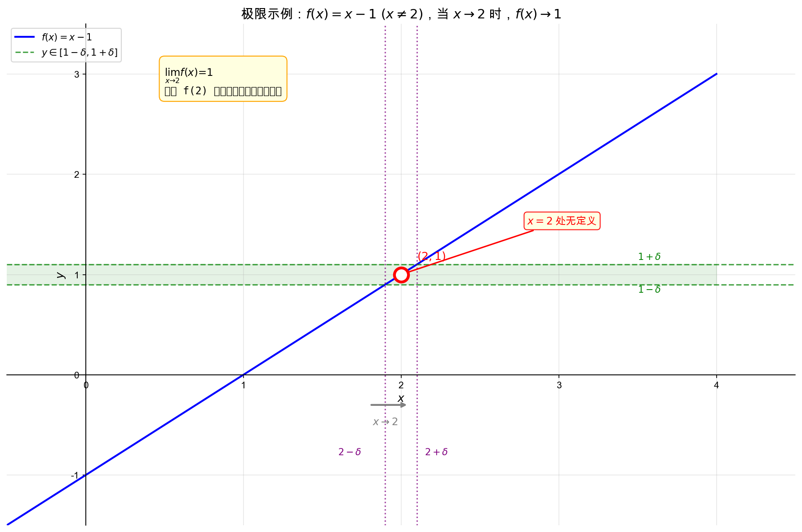

## 极限引入示例

让我们从一个具体的例子开始。考虑函数：

$$f(x) = x - 1 \quad (x \neq 2)$$

这个函数的图像是直线 $y = x - 1$，但在 $x = 2$ 处有一个**空心点**（即该点无定义）。

当 $x$ 越来越接近 2（但不等于 2）时，$f(x)$ 越来越接近 1：

- 如果要求 $f(x)$ 在 $1 \pm 0.0001$ 范围内，只需 $x$ 在 $1.9999$ 和 $2.0001$ 之间

这就是**极限**的思想：**$x$ 趋近于 2 时，$f(x)$ 趋近于 1**。

---

## 极限的符号表示

### 标准符号

我们用 "limit"（缩写 "Lim"）来表示极限：

$$\lim_{x \to 2} f(x) = 1$$

- $x \to 2$：写在 "Lim" 下方，表示 $x$ 趋近于 2
- $f(x)$：正常大小书写

### 描述性写法

> "当 $x$ 趋于 2 时，$f(x)$ 趋于 1"

这种写法偏描述性，做题时一般用标准符号更准确。

---

## 极限与定义的关系

> **重要结论**：极限存在与否和该点有无定义**完全无关**！

即使 $f(2)$ 无定义（如上例），极限依然可以存在。

反过来，即使 $f(2)$ 有定义，极限值和定义值也**没有任何必然联系**。

---

## 虚拟变量（哑变量）

在求极限过程中，变量只是一个**占位符**，可以替换成任意符号：

$$\lim_{x \to 1} (x + t) = \lim_{q \to 1} (q + t) = \lim_{b \to 1} (b + t) = 1 + t$$

### 关键点

- 虚拟变量只起"占位"作用，可以换成任意符号（$q$、$b$ 等）
- 求极限的**结果不包含虚拟变量**
- 但结果中可能包含**与虚拟变量无关的其他变量**（如上例中的 $t$）

---

## 本节核心要点

1. **极限描述的是"趋近"过程**，而不是"到达"
   - $x \to 2$ 意味着 $x$ 无限接近 2 但不等于 2

2. **极限与定义无关**：
   - 函数在某点无定义，极限可能存在
   - 函数在某点有定义，极限值和定义值可能不同

3. **虚拟变量可替换**：极限符号中的变量只是占位符

---

