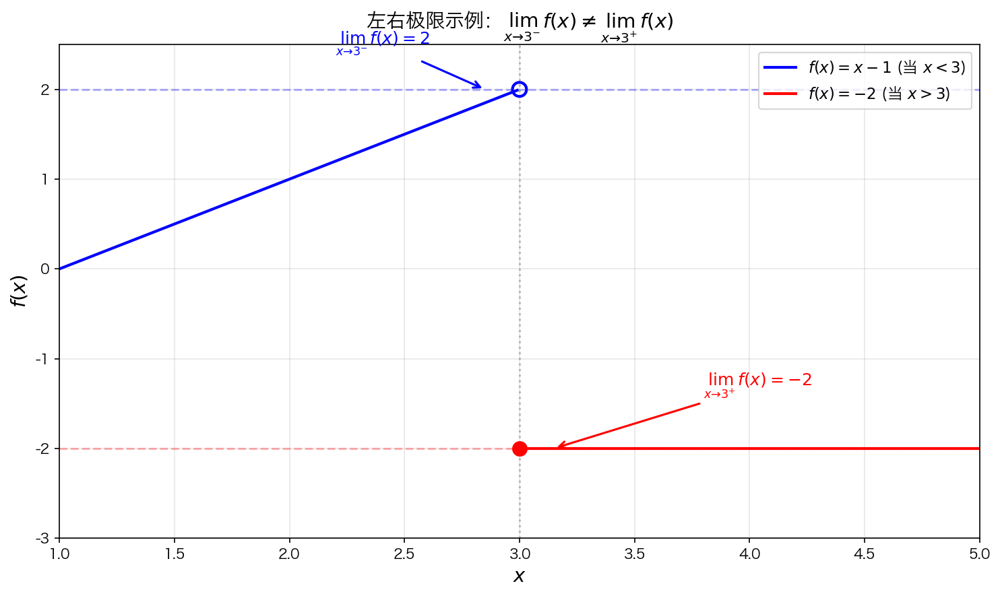
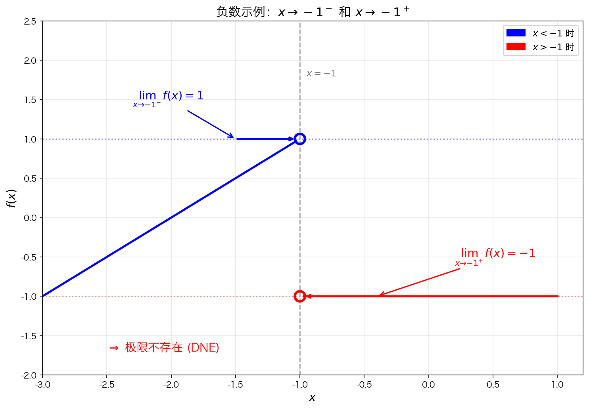
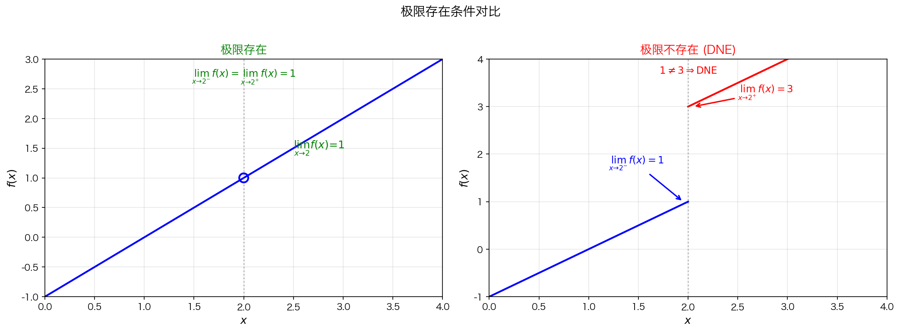

## 1. 极限的两种逼近方式

当 $x$ 趋于某个值 $a$ 时，实际上有两种可能的逼近方式：

| 逼近方式 | 表示方法 | 含义 |
|---------|---------|------|
| 从左侧逼近 | $x \to a^-$ | $x$ 从比 $a$ 小的方向趋近于 $a$ |
| 从右侧逼近 | $x \to a^+$ | $x$ 从比 $a$ 大的方向趋近于 $a$ |

## 2. 左极限与右极限

**左极限**：$x \to a^-$ 时函数的极限，记作 $\lim\limits_{x \to a^-} f(x)$

**右极限**：$x \to a^+$ 时函数的极限，记作 $\lim\limits_{x \to a^+} f(x)$

### 示例

如图所示的分段函数：

$$
f(x) = \begin{cases}
x - 2 & x < 3 \\
-2 & x > 3
\end{cases}
$$

- 当 $x \to 3^-$ 时，$f(x) \to 1$
- 当 $x \to 3^+$ 时，$f(x) \to -2$

## 3. 负数情况下的极限表示

| 表达式 | 含义 |
|-------|------|
| $x \to -1^-$ | $x$ 从 $-1$ 的左边逼近（比 $-1$ 更小） |
| $x \to -1^+$ | $x$ 从 $-1$ 的右边逼近（比 $-1$ 更大） |
| $x \to 0^-$ | $x$ 从 $0$ 的左边逼近（负数方向） |
| $x \to 0^+$ | $x$ 从 $0$ 的右边逼近（正数方向） |

## 4. 极限存在的条件

**充要条件**：双侧极限 $\lim\limits_{x \to a} f(x)$ 存在的充要条件是左极限和右极限都存在且**相等**。

$$
\lim_{x \to a} f(x) \text{ 存在} \iff \lim_{x \to a^-} f(x) = \lim_{x \to a^+} f(x)
$$

### 极限不存在的情况

若左右极限不相等，则双侧极限不存在，用 **DNE** 表示。

### 图2详细解读

这张图把本节最核心的思想表达清楚了。

#### 左图（情况1：极限存在）

**图像特点**：
- 一条连续直线
- 在 $x = 2$ 处有一个”空心点”（函数值可能未定义或不等于1）

**关键点**：
- 左边靠近 → 趋近 1
- 右边靠近 → 也趋近 1

$$\lim_{x \to 2^-} f(x) = 1, \quad \lim_{x \to 2^+} f(x) = 1$$

两边相等，所以 $\lim\limits_{x \to 2} f(x) = 1$

> **重点理解**：虽然点是空的（可能 $f(2)$ 不等于1甚至不存在），但极限仍然存在。**极限只看”靠近”，不看”点本身”**。

#### 右图（情况2：极限不存在）

**图像特点**：
- 左边是一条水平线（$y=1$）
- 右边是一条水平线（$y=3$）
- 在 $x=2$ 处出现”跳跃”

**关键点**：
- 左边靠近 → 1
- 右边靠近 → 3

$$\lim_{x \to 2^-} f(x) = 1, \quad \lim_{x \to 2^+} f(x) = 3$$

因为 $1 \neq 3$，所以 $\lim\limits_{x \to 2} f(x)$ 不存在（DNE）

#### 核心结论

> **极限存在 ⇔ 左极限 = 右极限**

#### 快速判断技巧

看到图就做三步：
1. **Step 1**：看左边 → 得一个值
2. **Step 2**：看右边 → 得一个值
3. **Step 3**：比较
   - 相等 → 极限存在
   - 不等 → 极限不存在

