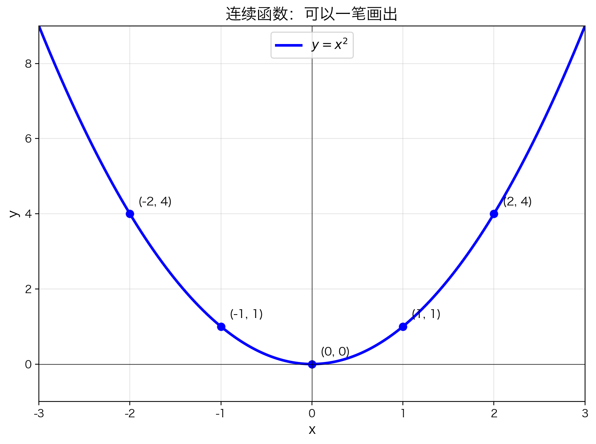
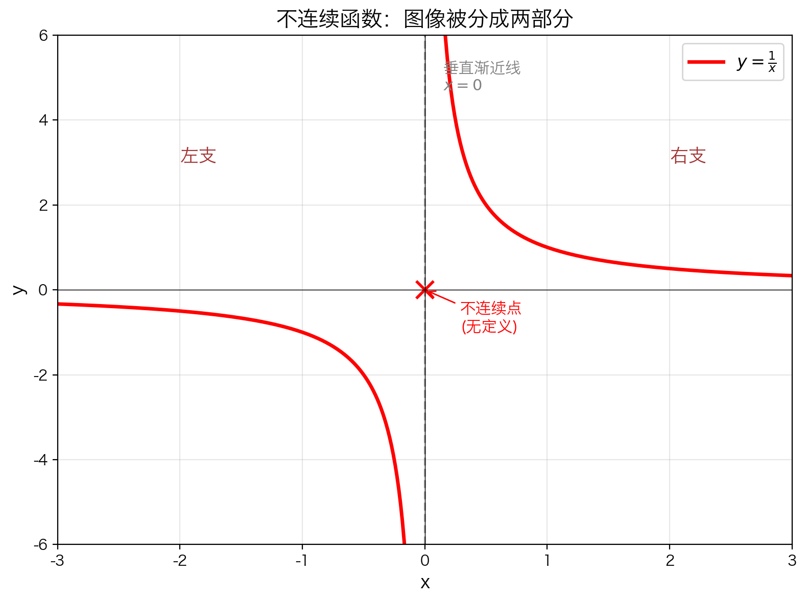

## 本节总览

第一章我们把函数理解为**"转换规则"**：输入一个 $x$，按照规则输出一个 $f(x)$。

但同样是函数，它们的"品质"可以大不相同。连续性就是用来描述这种"品质"的数学概念。

### 核心问题

当我们说一个函数是**连续的**，直觉上意味着什么？

> **一句话：连续函数的图像可以"一笔画出"，中间不抬笔、不跳跃。**

### 连续性是函数的"性质"

| 函数 | 图像特征 | 连续性 |
|------|---------|--------|
| $y = x^2$ | 光滑完整 | ✅ 处处连续 |
| $y = \frac{1}{x}$ | 在中间断开 | ❌ 在 $x = 0$ 处不连续 |
| 分段跳跃函数 | 突然跳上跳下 | ❌ 跳跃处不连续 |

**连续性是函数的一种"性质"**——就像人的身高、体重是属性一样，连续或不连续也是函数的属性。

### 本节知识结构

1. **直观理解**：一笔画出的图像就是连续的
2. **反例分析**：渐近线把图像断开，造成不连续
3. **关键点**：连续性要研究**"在某一点"**是否连续
4. **推广**：从单点连续到**区间连续**

---

## 连续性的直观理解

### "一笔画"的比喻

想象你用笔在纸上画函数图像：

- **连续函数**：笔尖始终不离开纸面，从头到尾一笔画完
- **不连续函数**：你必须在某处抬笔，跳过"断点"，才能继续画下去



对于 $y = x^2$ 这样的函数，它的图像是一条完整的抛物线。你可以从左下角开始，沿着曲线一直画到右下角，**笔尖从未离开纸面**——这就是连续。

---

## 不连续的反例：$y = \frac{1}{x}$



考虑函数：

$$f(x) = \frac{1}{x}$$

这个函数的图像**不是一块完整的图形**：

- 在 $x = 0$ 处，函数**无定义**（分母为零）
- $x = 0$ 处有一条**垂直渐近线**，把图像硬生生分成了**左右两支**
- 你无法一笔画出完整的图像——必须跳过 $x = 0$ 这个"缺口"

### 重要结论

> 如果 $f(x) = \frac{1}{x}$，那么 $f$ **在除了 $x = 0$ 以外的所有点处都是连续的**。

这说明：**连续性是一个"逐点"的性质**。一个函数可以在某些点连续，在另一些点不连续。

---

## 连续 vs 不连续：直观对比


| | $y = x^2$ | $y = \frac{1}{x}$ |
|---|---|---|
| **图像** | 完整的一条曲线 | 被渐近线分成两段 |
| **能否一笔画** | ✅ 能 | ❌ 不能 |
| **问题点** | 没有 | $x = 0$ 处断开 |
| **连续性** | 处处连续 | $x \neq 0$ 时连续 |

---

## 为什么需要"在一点处连续"的定义？

从上面的例子可以看出：

1. **笼统地说"函数连续"不够精确**——$y = \frac{1}{x}$ 在大部分地方是连续的，只在 $x = 0$ 处不连续
2. 我们必须先弄清楚：**在单个点上，"连续"到底是什么意思？**
3. 定义了"点连续"之后，才能讨论**区间上的连续性**（比如"在 $[0, 1]$ 上连续"）

### 研究路线

```
在一点处连续 → 在区间上连续 → 连续函数的性质
```

下一节将给出**在一点处连续的严格定义**。

---

## 本节总结

### 核心要点

- **直觉**：连续 = 图像可以一笔画出
- **关键观察**：不连续通常发生在函数"断开"或"跳跃"的地方
- **逐点性**：连续性是针对**每一个点**而言的性质
- **下一步**：需要严格定义"在一点处连续"

### 常见误区

❌ **误区**："不连续 = 图像分成两部分"

✅ **正解**：分成两部分只是不连续的一种表现形式。即使图像看起来"连在一起"，也可能在某点不连续（后面会学到"可去间断点"和"跳跃间断点"）。

---

## 本节内容

1. [5.1.1 在一点处连续](5.1.1%20在一点处连续.md) —— 连续性的严格定义
2. [5.1.2 在区间上连续](5.1.2%20在区间上连续.md) —— 从单点推广到区间
3. [5.1.3 连续函数的一些例子](5.1.3%20连续函数的一些例子.md) —— 常见连续函数
4. [5.1.4 介值定理](5.1.4%20介值定理.md) —— 连续函数不漏掉中间值
5. [5.1.5 奇数次多项式必有根](5.1.5%20奇数次多项式必有根.md) —— 介值定理的漂亮应用
6. [5.1.6 连续函数的最大值和最小值](5.1.6%20连续函数的最大值和最小值.md) —— 闭区间上必有最值
