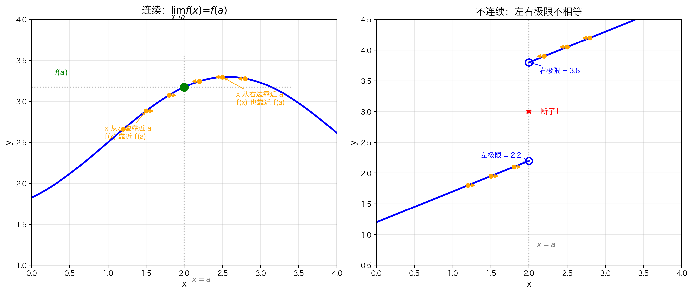
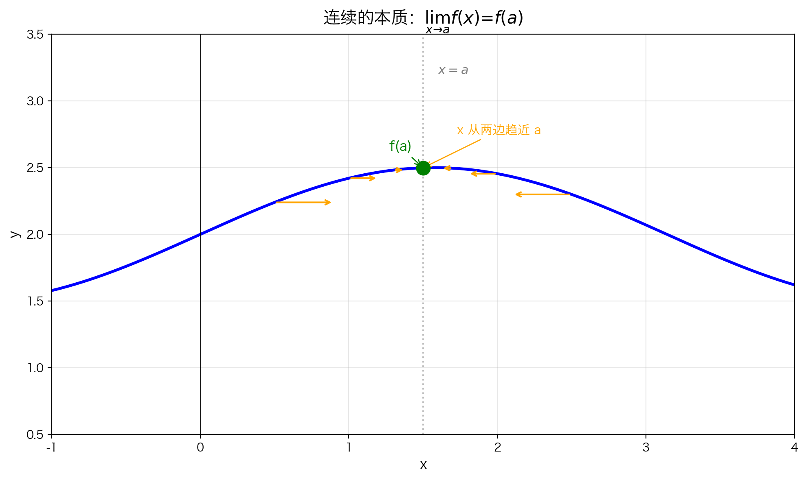
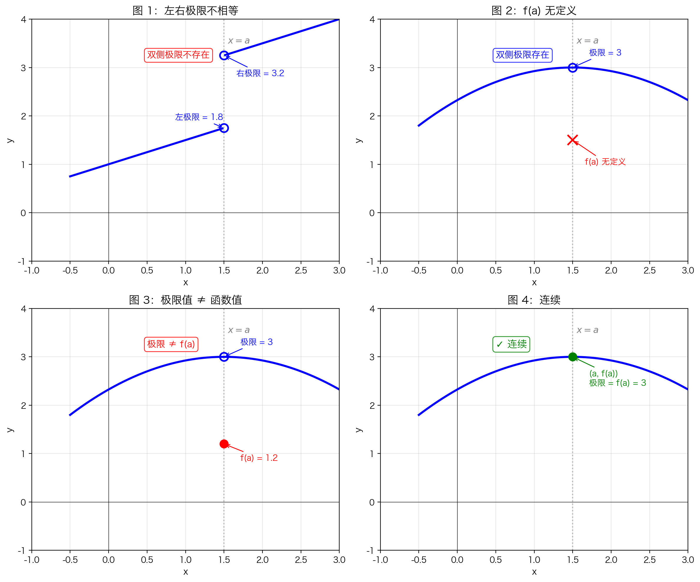

## 本节总览

这一节给出**"在一点处连续"的严格定义**，并分析三种导致不连续的情况。

### 核心思想

上一节说"连续就是能一笔画出"。现在我们把这句话**聚焦到一个点**上：

**画函数图像经过点 $(a, f(a))$ 时，笔尖能不能不抬、顺滑地通过？**

这就是"在一点处连续"的直觉。

---

## 从直觉到定义

### 第一步："不抬笔"是什么意思？

假设你正在画 $y = f(x)$ 的图像，笔尖从左向右移动。当你接近 $x = a$ 这个位置时：

- 从左边靠近 $a$，笔尖的高度会趋向某个值
- 从右边靠近 $a$，笔尖的高度也会趋向某个值
- 如果这两个趋向的值**都等于** $f(a)$，你就能一笔画过去

换句话说：**当 $x$ 越来越接近 $a$ 时，$f(x)$ 必须越来越接近 $f(a)$**。

**左图（连续）**：从左右两边靠近 $x = a$ 时，函数值都趋向同一个高度 $f(a)$，笔尖可以一笔画过去。

**右图（不连续）**：左边靠近趋向 2.2，右边靠近趋向 3.8，中间"断了"，必须抬笔才能继续画。

### 第二步：这正是极限

"$x$ 接近 $a$ 时，$f(x)$ 接近 $f(a)$" 这句话的数学表达就是：

$$\lim_{x \to a} f(x) = f(a)$$

这就是**连续性的严格定义**。

### 第三步：为什么需要三个条件？

连续的定义是一个**等式**：

$$\lim_{x \to a} f(x) = f(a)$$

等式有**左边**和**右边**。要让这个等式有意义且成立，必须回答三个问题：

---

#### 条件 1：左边的极限存在吗？

**问题**：$\displaystyle\lim_{x \to a} f(x)$ 存在吗？

双侧极限存在的意思是：**左极限 = 右极限**，且都是有限值。

**如果不满足会怎样？**

看上图中**标号为 1** 的情况：从左边趋近 $a$ 时，$f(x)$ 趋向 1.75；从右边趋近时，趋向 3.25。左右极限不相等，双侧极限**根本不存在**。

这时候等式左边都没有定义，谈何连续？

> 就像问"张三和李四相等吗"，但如果张三这个人不存在，这个问题就没有意义。

---

#### 条件 2：右边的函数值有定义吗？

**问题**：$f(a)$ 存在吗？

即使极限存在，如果函数在 $x = a$ 处根本没有定义，等式右边就是空的。

**如果不满足会怎样？**

看上图中**标号为 2** 的情况：左右极限都等于 3，双侧极限存在。但图像在 $x = a$ 处是一个**空心点**——函数在这里没有定义，$f(a)$ 不存在。

这时候等式是"$3 = \text{不存在}$"，显然不成立。

> 就像约会：你已经到了（极限存在），但对方根本没出现（$f(a)$ 无定义），这约会不算成功。

---

#### 条件 3：两边相等吗？

**问题**：$\displaystyle\lim_{x \to a} f(x) = f(a)$ 吗？

即使极限存在、$f(a)$ 也有定义，如果这两个数不相等，等式仍然不成立。

**如果不满足会怎样？**

看上图中**标号为 3** 的情况：双侧极限存在且等于 3，$f(a)$ 也有定义且等于 1.2。但 $3 \neq 1.2$！

这意味着：当你沿着曲线趋近 $a$ 时，你预期会到达高度 3，但函数实际把你放到了高度 1.2——笔尖还是"跳"了一下。

> 就像约会：你到了（极限存在），对方也到了（$f(a)$ 有定义），但来的不是你要等的那个人（数值不相等），这也不算成功。

---

#### 总结

| 条件 | 检查什么 | 失败时的样子 | 等式状态 |
|------|---------|------------|---------|
| (1) 极限存在 | 左极限 = 右极限？ | 图1：左右两边高度不同 | 左边无意义 |
| (2) $f(a)$ 存在 | 该点有定义吗？ | 图2：该点是空心点 | 右边无意义 |
| (3) 两者相等 | 极限值 = 函数值？ | 图3：实心点位置不对 | 等式不成立 |

**三个条件必须同时满足，缺一不可。** 只有像图 4 那样：极限存在、函数有定义、且两者相等，函数才是连续的。

---

## 定义

**函数 $f$ 在点 $x = a$ 处连续**，当且仅当：

$$\lim_{x \to a} f(x) = f(a)$$

等价地说，必须同时满足：

1. 双侧极限 $\displaystyle\lim_{x \to a} f(x)$ 存在（且有限）
2. $f(a)$ 有定义（且有限）
3. 两者相等

---

## 四种情况对比

### 图1：左右极限不相等（条件1不满足）

- 左极限 $\neq$ 右极限
- 双侧极限**不存在**
- **结论**：函数在 $x = a$ 处**不连续**
- 这种间断点称为**跳跃间断点**

### 图2：$f(a)$ 无定义（条件2不满足）

- 左极限 = 右极限，双侧极限**存在**
- 但函数在 $x = a$ 处**无定义**（空心点位置没有函数值）
- **结论**：函数在 $x = a$ 处**不连续**
- 这种间断点称为**可去间断点**

### 图3：极限值 $\neq$ 函数值（条件3不满足）

- 双侧极限**存在**
- $f(a)$ **有定义**
- 但 $\displaystyle\lim_{x \to a} f(x) \neq f(a)$
- **结论**：函数在 $x = a$ 处**不连续**
- 这种间断点也称为**可去间断点**

### 图4：连续（三个条件都满足）✓

- 双侧极限**存在**
- $f(a)$ **有定义**
- $\displaystyle\lim_{x \to a} f(x) = f(a)$
- **结论**：函数在 $x = a$ 处**连续**

---

## 间断点类型速查

前三个图中的函数在 $x = a$ 处都有**间断点**，但原因不同：

| 图示 | 间断原因 | 间断点类型 |
|------|---------|-----------|
| 图1 | 左右极限不相等 | **跳跃间断点** |
| 图2 | 极限存在但 $f(a)$ 无定义 | **可去间断点** |
| 图3 | 极限存在且 $f(a)$ 有定义，但两者不等 | **可去间断点** |
| 图4 | 无间断 | 连续 |

> **注意**："可去"意味着只要重新定义（或补定义）$f(a)$ 的值，就能让函数在该点连续。

---

## 本节总结

### 核心定义

$$f \text{ 在 } x = a \text{ 处连续} \quad\Leftrightarrow\quad \lim_{x \to a} f(x) = f(a)$$

### 三条件 checklist

- [ ] 双侧极限存在且有限
- [ ] $f(a)$ 存在且有限
- [ ] 极限值 = 函数值

### 常见误区

❌ **误区**："只要图像连在一起就是连续的"

✅ **正解**：连续是**逐点**的性质。一条曲线可能大部分连续，但只要在某个点不满足三条件之一，就在那里不连续。

❌ **误区**："$f(a)$ 有定义，函数就在 $a$ 处连续"

✅ **正解**：$f(a)$ 有定义只是必要条件之一，还需要极限存在且等于 $f(a)$。

---

## 下一节

学会了单点连续的定义后，我们把它扩展到**区间**上：

→ [5.1.2 在区间上连续](5.1.2%20在区间上连续.md)
