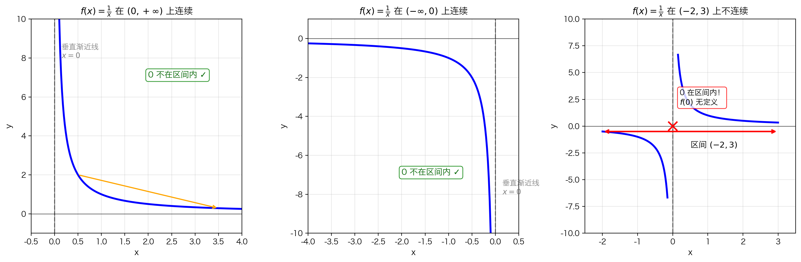
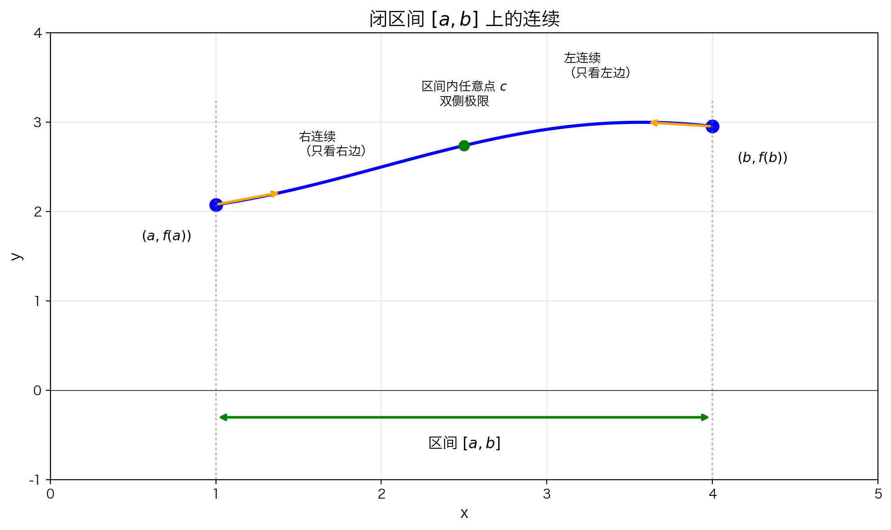
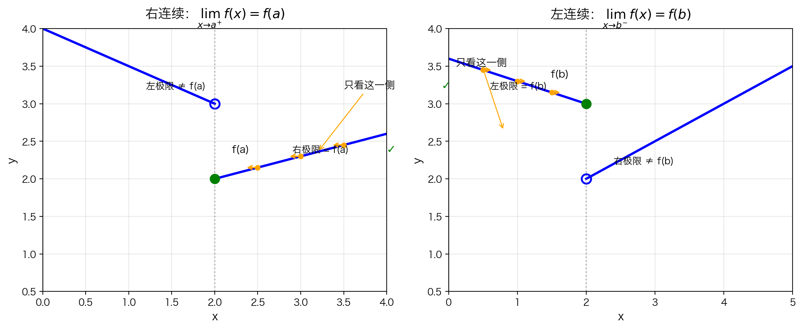

## 本节总览

上一节学习了**单点连续**，现在把定义扩展到**区间**上。

### 核心思想

区间上的连续，本质上就是**区间内每一个点都连续**。

- **开区间** $(a, b)$：区间内部每一点都连续即可
- **闭区间** $[a, b]$：内部每点连续 + 端点处的**单侧连续**

### 关键区别

| 区间类型 | 端点要求 | 原因 |
|---------|---------|------|
| $(a, b)$ | 不需要检查端点 | 端点不在区间内 |
| $[a, b]$ | 需要单侧连续 | 端点外没有定义，只能看一侧 |

---

## 开区间上的连续

### 定义

如果函数 $f$ 在开区间 $(a, b)$ 上的**每一点**都连续，就说 $f$ 在 $(a, b)$ 上连续。


#### "每一点都连续"是什么意思？

随便在 $(a, b)$ 内选一个点 $c$（无论选哪里），都必须满足单点连续的三条件：

$$\lim_{x \to c} f(x) = f(c)$$

也就是说：
- 从**左边**趋近 $c$ 时，$f(x) \to f(c)$ ✓
- 从**右边**趋近 $c$ 时，$f(x) \to f(c)$ ✓

因为 $c$ 在区间**内部**，左右两侧都有定义，所以必须检查**双侧极限**。

#### 为什么端点不需要检查？

开区间的符号是 $(a, b)$，那个小括号 `(` `)` 的意思就是：**端点被排除在外**。

- $a \notin (a, b)$，所以 $f$ 在 $a$ 处有没有定义、连不连续，都不影响 $f$ 在 $(a, b)$ 上的连续性
- $b \notin (a, b)$，同理

> 就像一家 club 只管理 club **里面**的人，门口站着的人不归你管。

注意：这里**不需要**检查端点 $x = a$ 和 $x = b$，因为它们不在开区间 $(a, b)$ 内。

### 例子：$f(x) = \frac{1}{x}$



**在 $(0, +\infty)$ 上连续** ✓

- $f(x) = \frac{1}{x}$ 在 $x > 0$ 的每一点都有定义
- 每一点的极限都等于函数值
- $x = 0$ 不在区间内，不需要考虑

**在 $(-\infty, 0)$ 上也连续** ✓

- 同理，在 $x < 0$ 的每一点都连续
- $x = 0$ 不在区间内

**但在 $(-2, 3)$ 上不连续** ✗

- 因为 $0 \in (-2, 3)$，而 $f(0)$ 无定义
- 区间内存在不连续的点，所以整个区间上不连续

> **重要**：只要在区间内有**一个点**不连续，函数在该区间上就不连续。

---

## 闭区间上的连续

### 问题：端点怎么办？



考虑函数定义在 $[a, b]$ 上的情况（如上图）。在端点处有个特殊问题：

- **在 $x = a$（左端点）**：函数的图像从 $a$ 开始，左边没有定义
  - 不存在"从左边趋近 $a$"，只有**右极限** $\displaystyle\lim_{x \to a^+} f(x)$

- **在 $x = b$（右端点）**：函数的图像到 $b$ 结束，右边没有定义
  - 不存在"从右边趋近 $b$"，只有**左极限** $\displaystyle\lim_{x \to b^-} f(x)$

### 定义

函数 $f$ 在闭区间 $[a, b]$ 上连续，如果同时满足以下三个条件：

**条件 1**：$f$ 在 **开区间** $(a, b)$ 内的**每一点**都连续

> 内部点和开区间要求一样：任取 $c \in (a, b)$，必须有 $\displaystyle\lim_{x \to c} f(x) = f(c)$（双侧极限）。

**条件 2**：$f$ 在 **左端点 $a$ 处右连续**

$$\lim_{x \to a^+} f(x) = f(a)$$

即：从 $a$ 的**右侧**趋近时，函数值恰好趋向 $f(a)$。

**条件 3**：$f$ 在 **右端点 $b$ 处左连续**

$$\lim_{x \to b^-} f(x) = f(b)$$

即：从 $b$ 的**左侧**趋近时，函数值恰好趋向 $f(b)$。

#### 拆解理解

| 位置 | 需要检查什么 | 原因 |
|------|------------|------|
| 内部点 $c \in (a, b)$ | 双侧连续 | 左右两侧都有定义 |
| 左端点 $x = a$ | 右连续 | 左侧没有定义，只能看右边 |
| 右端点 $x = b$ | 左连续 | 右侧没有定义，只能看左边 |

> **直观记忆**：闭区间用方括号 $[\quad]$，表示"把端点包进来"。包进来的点就要检查连续性，但由于端点外侧没有函数定义，所以只能检查**有定义的那一侧**。

换句话说：闭区间连续 = 内部双侧连续 + 左端点右连续 + 右端点左连续。三个条件**缺一不可**。

---

## 单侧连续

### 直观理解



**右连续**（左图）：只看端点**右侧**的情况
- $x$ 从 $a$ 的右边趋近时，$f(x) \to f(a)$
- 左边是什么无所谓（甚至可能没有定义）

**左连续**（右图）：只看端点**左侧**的情况
- $x$ 从 $b$ 的左边趋近时，$f(x) \to f(b)$
- 右边是什么无所谓

### 定义

**右连续**：$\displaystyle\lim_{x \to a^+} f(x) = f(a)$

即：从右侧趋近 $a$ 时，极限值恰好等于 $a$ 点的函数值。$a$ 点左侧的函数行为**完全不影响**右连续的判定。

**左连续**：$\displaystyle\lim_{x \to b^-} f(x) = f(b)$

即：从左侧趋近 $b$ 时，极限值恰好等于 $b$ 点的函数值。$b$ 点右侧的函数行为**完全不影响**左连续的判定。

### 与双侧连续的关系

| | 左极限 = f(端点)？ | 右极限 = f(端点)？ | 结论 |
|---|---|---|---|
| 区间内点 | 需要 ✓ | 需要 ✓ | 双侧连续 |
| 左端点 $a$ | 不需要 | 需要 ✓ | 右连续即可 |
| 右端点 $b$ | 需要 ✓ | 不需要 | 左连续即可 |

---

## 函数的整体连续性

### 定义

如果函数 $f$ 在**其定义域中的每一个点**都连续，我们就说 $f$ 是**连续的**。

#### 什么意思？

"连续"是对**整个函数**的一个总体评价。要得到这个评价，必须逐点检查：

1. 取出 $f$ 的**定义域** $\text{dom}(f)$
2. 对定义域中的**每一个点** $x$，检查 $f$ 在 $x$ 处是否连续
3. 如果**全部通过**，才说 "$f$ 是连续的"

#### 端点怎么处理？

如果定义域包含闭区间的端点（例如定义域是 $[0, 1]$），那些端点只需要**单侧连续**：
- $x = 0$ 处：右连续即可
- $x = 1$ 处：左连续即可

这和闭区间上连续的逻辑完全一致。

#### 为什么强调"在定义域上"？

因为函数只能在自己的定义域内讨论连续性。定义域外的点，函数连定义都没有，更谈不上连续不连续。

### 例子

| 函数 | 定义域 | 连续性结论 |
|------|--------|-----------|
| $f(x) = x^2$ | $\mathbb{R}$ | **处处连续** |
| $f(x) = \frac{1}{x}$ | $(-\infty, 0) \cup (0, +\infty)$ | **在其定义域上连续** |

> 注意：说 "$f(x) = \frac{1}{x}$ 连续"时，隐含的意思是"**在定义域上**连续"。我们不会说它在整个 $\mathbb{R}$ 上连续，因为 $x = 0$ 处没有定义，根本不在讨论范围内。

---

## 本节总结

### 区间连续的判断流程

```
区间类型？
├── 开区间 (a, b)
│   └── 检查区间内每一点是否双侧连续
└── 闭区间 [a, b]
    ├── 检查 (a, b) 内每一点是否双侧连续
    ├── 检查 x = a 是否右连续
    └── 检查 x = b 是否左连续
```

### 核心要点

1. **开区间**：只管内部，不管端点
2. **闭区间**：内部双侧连续 + 端点单侧连续
3. **整体连续**：定义域内每一点都连续（端点只需单侧）
4. **区间内有一个点不连续** → 整个区间上不连续

### 常见误区

❌ **误区**："闭区间上连续，端点也需要双侧极限"

✅ **正解**：端点外可能没有定义，只能用单侧极限。左端点看右极限，右端点看左极限。

❌ **误区**："$f(x) = \frac{1}{x}$ 不连续"

✅ **正解**：$f(x) = \frac{1}{x}$ **在其定义域上是连续的**，只是在 $x = 0$ 处没有定义，因此不能说它在包含 0 的区间上连续。

---

## 下一节

知道了连续的定义和判断方法，来看看**哪些常见函数是连续的**：

→ [5.1.3 连续函数的一些例子](5.1.3%20连续函数的一些例子.md)
