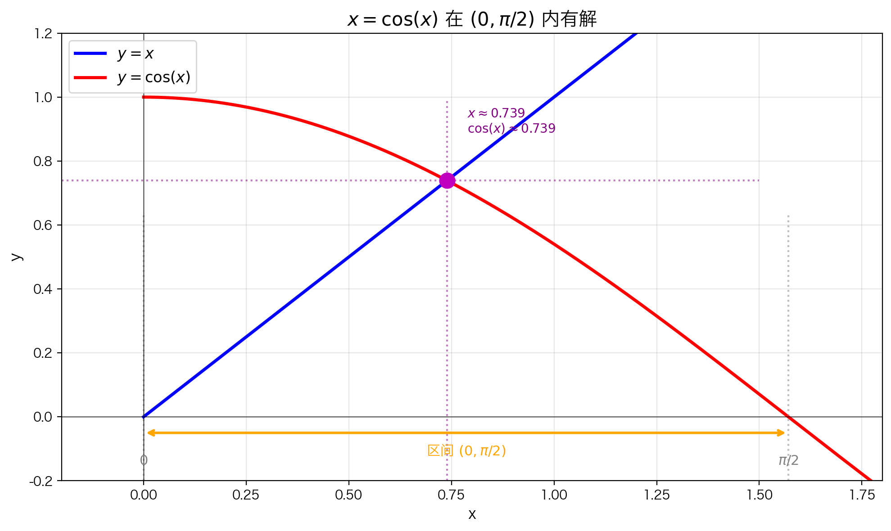

## 本节总览

[上一节](5.1.3%20连续函数的一些例子.md)我们知道了哪些函数是连续的。现在来研究一个关键问题：**连续性有什么用？**

连续函数的图像可以一笔画出，这个性质带来了一些非常强大的结论。这一节介绍的**介值定理**就是其中之一。

在数学里，这个直觉被称为**介值定理**（Intermediate Value Theorem，简称 IVT）。

### 本节知识结构

1. **生活直觉**：连续变化必然经过中间值
2. **数学翻译**：把生活直觉写成严格定理
3. **为什么必须连续**：不连续就可以"跳过"
4. **实际应用**：证明方程有解、找零点
5. **推广**：不限于 0，任何中间值都可以

---

## 从生活例子开始

### 例子 1：温度变化

昨天凌晨最低气温是 **5°C**，今天午后最高气温是 **25°C**。

问：在这两天之间的某个时刻，温度有没有恰好是 **15°C**？

答案是**一定有**。因为气温是连续变化的（不会从 5°C 瞬间跳到 25°C），从 5 到 25 的过程中，必然要经过 15 这个中间值。

### 例子 2：爬山

你从山脚（海拔 **100 米**）爬到山顶（海拔 **1000 米**），全程没有 teleport（瞬间传送）。

问：你有没有经过海拔 **500 米** 的地方？

**一定有。** 连续爬升的过程中，不可能跳过 500 米这个高度。

### 例子 3：电梯

电梯从 **1 楼** 上升到 **10 楼**，运行平稳没有故障。

问：电梯有没有经过 **5 楼**？

**一定有。** 这就是连续性的力量——**中间值一个都漏不掉**。

---

## 翻译成数学：介值定理

把上面的直觉翻译成数学语言，就是介值定理。

### 最简单的情况：找零点

假设函数 $f$ 的图像是一条**不间断的曲线**。如果：

- 在 $x = a$ 处，图像在 x 轴**下方**（$f(a) < 0$）
- 在 $x = b$ 处，图像在 x 轴**上方**（$f(b) > 0$）

那么从下方走到上方的过程中，图像**必然**会在某处穿过 x 轴——也就是说，在 $a$ 和 $b$ 之间一定存在一个点 $c$，使得 $f(c) = 0$。

> 就像从地下通道走到地面上，你一定会经过地面高度（海拔 0 米）。

### 严格表述（零点形式）

**如果**：

1. $f$ 在闭区间 $[a, b]$ 上连续（图像一笔画成，中间不断）
2. $f(a)$ 和 $f(b)$ **符号相反**（一正一负）

**那么**：一定存在某个 $c \in (a, b)$，使得 $f(c) = 0$。

### 不连续就不行

如果图像在某处**断开**了（不连续），函数可以直接从下方"跳"到上方，**跳过** x 轴——这时候就不存在零点了。

所以介值定理的前提是：**整个区间上都必须连续**，不能有任何断开。

---

## 应用一：证明多项式有零点

### 例子

证明多项式 $p(x) = -x^5 + x^4 + 3x + 1$ 在 $(1, 2)$ 内有一个 x 轴截距。

**步骤**：

1. $p$ 是多项式，所以**处处连续**（包含 $[1, 2]$）
2. 计算端点值：
   - $p(1) = -1 + 1 + 3 + 1 = 4 > 0$
   - $p(2) = -32 + 16 + 6 + 1 = -9 < 0$
3. $p(1)$ 和 $p(2)$ **符号相反**

**结论**：根据介值定理，在 $(1, 2)$ 内至少存在一点 $c$，使得 $p(c) = 0$。

> 注意：介值定理只告诉我们**存在**这样的 $c$，但**不告诉我们 $c$ 具体是多少**，也不告诉我们有多少个这样的 $c$。

---

## 应用二：证明方程有解

### 问题

证明方程 $x = \cos(x)$ 至少有一个解。

### 思路

不需要求出解，只需要证明存在性。

**第一步**：移项，令 $f(x) = x - \cos(x)$

如果能证明 $f(c) = 0$，那么 $c - \cos(c) = 0$，即 $c = \cos(c)$，$c$ 就是方程的解。

**第二步**：找到合适的区间

从图像上看，解大约在 $x \approx 0.739$ 附近。保守地取区间 $[0, \pi/2]$：

- $f(0) = 0 - \cos(0) = -1 < 0$
- $f(\pi/2) = \pi/2 - \cos(\pi/2) = \pi/2 > 0$

**第三步**：应用介值定理

$f$ 是两个连续函数的差，所以连续。$f(0) < 0$ 且 $f(\pi/2) > 0$，符号相反。

**结论**：根据介值定理，在 $(0, \pi/2)$ 内存在 $c$，使得 $f(c) = 0$，即 $x = \cos(x)$ 有解。

> 实际上解不是 $\pi/4$，而且不存在用初等函数表示的闭式解。介值定理的强大之处就在于：**不需要找到解，就能证明解存在**。

---

## 推广：介值定理的一般形式

### 从 0 推广到任意 M

介值定理不限于 $f(c) = 0$，可以换成**任意目标值 $M$**：

**如果**：

1. $f$ 在 $[a, b]$ 上连续
2. $f(a) < M < f(b)$（或反过来）

**那么**：存在 $c \in (a, b)$，使得 $f(c) = M$。

### 生活例子：热水器温度

你家的热水器从 **20°C** 加热到 **60°C**，加热过程是连续的。

问：加热过程中有没有恰好达到 **40°C** 的时刻？

**一定有。** 40 被 20 和 60 "夹"在中间，连续变化过程中必然会经过。

这就是介值定理的推广：目标值不一定是 0，可以是**任意一个被两端夹住的中间值**。

### 数学例子

设 $f(x) = 3^x + x^2$，方程 $f(x) = 5$ 有解吗？

- $f(0) = 1 < 5$
- $f(2) = 13 > 5$

1 和 13 夹着 5，且 $f$ 连续，所以必然存在某个 $c \in (0, 2)$ 使得 $f(c) = 5$。

> 小技巧：也可以移项变成 $g(x) = 3^x + x^2 - 5 = 0$，用原来的零点形式来解决。

---

## 本节总结

### 介值定理核心

$$f \text{ 在 } [a,b] \text{ 连续，且 } f(a) \text{ 与 } f(b) \text{ 异号} \quad \Rightarrow \quad \exists c \in (a,b), \; f(c) = 0$$

### 关键点

| 要点 | 说明 |
|------|------|
| **连续性** | 必须在**整个闭区间**上连续 |
| **闭区间** | 定理要求 $[a, b]$，不是 $(a, b)$ |
| **符号相反** | $f(a)$ 和 $f(b)$ 必须一正一负 |
| **存在性** | 只保证至少存在一个 $c$，不唯一 |
| **推广** | 0 可以换成任意目标值 $M$ |

### 常见用法

1. **证明多项式有零点**：计算两个点的函数值，看是否异号
2. **证明方程有解**：移项构造函数，验证端点异号
3. **证明存在某函数值**：用推广形式，目标值夹在两端函数值之间

### 常见误区

❌ **误区**："介值定理能帮我找到零点的精确位置"

✅ **正解**：介值定理只证明**存在性**，不给出具体值。要找精确值需要用数值方法（如二分法）。

❌ **误区**："开区间上的连续函数也满足介值定理"

✅ **正解**：定理明确要求**闭区间** $[a, b]$。开区间端点可能无定义或极限不存在。

---

## 下一节

介值定理看似简单，却能证明一些非常深刻的结论。比如：**任意奇数次多项式都至少有一个根**。

→ [5.1.5 奇数次多项式必有根](5.1.5%20奇数次多项式必有根.md)
