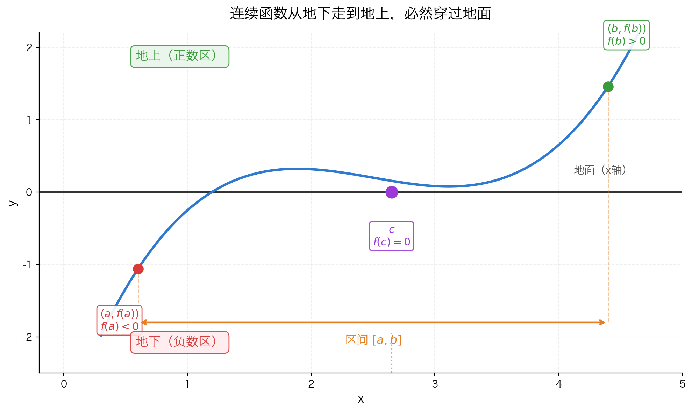
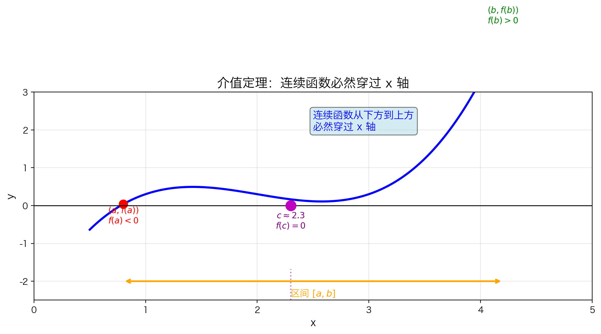
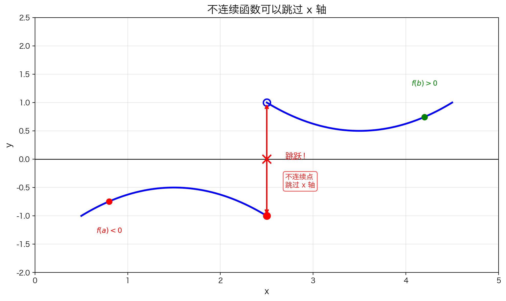

## 本节总览

[上一节](5.1.3%20连续函数的一些例子.md)我们知道了哪些函数是连续的。现在来研究一个关键问题：**连续性有什么用？**

连续函数的图像可以一笔画出，这个性质带来了一些非常强大的结论。这一节介绍的**介值定理**就是其中之一。

在数学里，这个直觉被称为**介值定理**（Intermediate Value Theorem，简称 IVT）。

### 本节知识结构

1. **生活直觉**：连续变化必然经过中间值
2. **数学翻译**：把生活直觉写成严格定理
3. **为什么必须连续**：不连续就可以"跳过"
4. **实际应用**：证明方程有解、找零点
5. **推广**：不限于 0，任何中间值都可以

---

## 原文核心思想拆解

> **原文**：知道一个函数是连续的会有很多好处。我们将看看其中两个好处。第一个被称为介值定理。其基本思想是：假设一个函数 $f$ 在一个闭区间 $[a, b]$ 上连续。此外，假设 $f(a) < 0$ 且 $f(b) > 0$。因此，在 $y = f(x)$ 的图像上，点 $(a, f(a))$ 位于 x 轴的下方，而点 $(b, f(b))$ 位于 x 轴的上方。

### 逐句理解

**"知道一个函数是连续的会有很多好处"**

→ 上一节学了"什么是连续"，这一节开始讲**连续有什么用**。就像学会开车后，接下来要学的是——开车能带你去哪里。

**"第一个被称为介值定理"**

→ **介值** = 介于两个值之间的值。这个定理的核心就是：连续函数不会"跳过"中间任何一个值。

**"假设一个函数 $f$ 在一个闭区间 $[a, b]$ 上连续"**

→ 闭区间 $[a,b]$ 就是包含两个端点的一段线段。函数在这段上的图像是**一笔画成**的，中间不能断开。

**"假设 $f(a) < 0$ 且 $f(b) > 0$"**

→ 在左端点 $a$ 处，函数值是**负数**（图像在 x 轴**下方**）；在右端点 $b$ 处，函数值是**正数**（图像在 x 轴**上方**）。

---

### 已知条件整理

**已知：**

函数 $f(x)$ 在闭区间 $[a,b]$ 上连续
（也就是从 $a$ 到 $b$ 整段图像没有断裂、没有瞬移）

**并且：**

- $f(a) < 0$ → 起点在 x 轴**下方**
- $f(b) > 0$ → 终点在 x 轴**上方**

**图像上意味着什么？**

你从左边点 $(a, f(a))$ 出发时在**地下**（负数区），走到右边点 $(b, f(b))$ 时已经到了**地上**（正数区）。



### 直觉图像

把上面的条件画出来，就是下面这样：

```
      f(b) > 0  ★
              ╱
             ╱
    ────────●────────  ← 这里必然穿过 x 轴！
           ╱
          ╱
    ★ f(a) < 0
```

### 核心结论（定理没说完的部分）

既然图像从 x 轴**下方**一笔画到**上方**，中间必然要在某处**穿过 x 轴**。就像你站在地下室走上地面，一定会经过地面高度（海拔 0 米）。

### 一句话总结

> **连续函数如果一头在 x 轴下、一头在 x 轴上，那中间必然穿过 x 轴至少一次。**

---

## 从生活例子开始

### 例子 1：温度变化

昨天凌晨最低气温是 **5°C**，今天午后最高气温是 **25°C**。

问：在这两天之间的某个时刻，温度有没有恰好是 **15°C**？

答案是**一定有**。因为气温是连续变化的（不会从 5°C 瞬间跳到 25°C），从 5 到 25 的过程中，必然要经过 15 这个中间值。

### 例子 2：爬山

你从山脚（海拔 **100 米**）爬到山顶（海拔 **1000 米**），全程没有 teleport（瞬间传送）。

问：你有没有经过海拔 **500 米** 的地方？

**一定有。** 连续爬升的过程中，不可能跳过 500 米这个高度。

### 例子 3：电梯

电梯从 **1 楼** 上升到 **10 楼**，运行平稳没有故障。

问：电梯有没有经过 **5 楼**？

**一定有。** 这就是连续性的力量——**中间值一个都漏不掉**。

---

## 翻译成数学：介值定理

把上面的直觉翻译成数学语言，就是介值定理。

### 最简单的情况：找零点



假设函数 $f$ 的图像是一条**不间断的曲线**。如果：

- 在 $x = a$ 处，图像在 x 轴**下方**（$f(a) < 0$）
- 在 $x = b$ 处，图像在 x 轴**上方**（$f(b) > 0$）

那么从下方走到上方的过程中，图像**必然**会在某处穿过 x 轴——也就是说，在 $a$ 和 $b$ 之间一定存在一个点 $c$，使得 $f(c) = 0$。

> 就像从地下通道走到地面上，你一定会经过地面高度（海拔 0 米）。

### 严格表述（零点形式）

**如果**：

1. $f$ 在闭区间 $[a, b]$ 上连续（图像一笔画成，中间不断）
2. $f(a)$ 和 $f(b)$ **符号相反**（一正一负）

**那么**：一定存在某个 $c \in (a, b)$，使得 $f(c) = 0$。

### 不连续就不行



如果图像在某处**断开**了（不连续），函数可以直接从下方"跳"到上方，**跳过** x 轴——这时候就不存在零点了。

所以介值定理的前提是：**整个区间上都必须连续**，不能有任何断开。

---

## 应用一：证明多项式有零点

### 例子

证明多项式 $p(x) = -x^5 + x^4 + 3x + 1$ 在 $(1, 2)$ 内有一个 x 轴截距。

**步骤**：

1. $p$ 是多项式，所以**处处连续**（包含 $[1, 2]$）
2. 计算端点值：
   - $p(1) = -1 + 1 + 3 + 1 = 4 > 0$
   - $p(2) = -32 + 16 + 6 + 1 = -9 < 0$
3. $p(1)$ 和 $p(2)$ **符号相反**

**结论**：根据介值定理，在 $(1, 2)$ 内至少存在一点 $c$，使得 $p(c) = 0$。

> 注意：介值定理只告诉我们**存在**这样的 $c$，但**不告诉我们 $c$ 具体是多少**，也不告诉我们有多少个这样的 $c$。

---

## 应用二：证明方程有解

### 问题

证明方程 $x = \cos(x)$ 至少有一个解。

---

### 先搞懂：这题在问什么？

**$x = \cos(x)$ 是什么意思？**

就是问：**有没有一个数 $x$，它恰好等于自己的余弦值？**

你可以试着猜几个数：
- $x = 0$ 时，右边 $\cos(0) = 1$，左边 $0 \neq 1$ ❌
- $x = 1$ 时，右边 $\cos(1) \approx 0.54$，左边 $1 \neq 0.54$ ❌
- $x = \pi/4$ 时，右边 $\cos(\pi/4) \approx 0.707$，左边 $0.785 \neq 0.707$ ❌

你试了很多数，好像都不是。那这个方程到底有没有解？

---

### 核心思路：把"方程有解"变成"函数有零点"

这是最关键的一步，理解了就通了。

**生活类比**：

你想证明"某个房间里有人"。直接进去找很难，但你可以换一个思路——证明"房间里发出了声音"。有声音 = 有人（假设只有人能发出声音）。

这里的"换思路"就是：**把方程变形，让右边变成 0**。

**具体做法**：

$$x = \cos(x) \quad \xrightarrow{\text{移项}} \quad x - \cos(x) = 0$$

令 $f(x) = x - \cos(x)$，那么：

> **原方程有解** $\Leftrightarrow$ **存在某个 $c$，使得 $f(c) = 0$**

也就是说，我们不需要直接找满足 $x = \cos(x)$ 的数，只需要证明函数 $f(x) = x - \cos(x)$ 的图像**穿过 x 轴**就行了！

这就正好是介值定理的用武之地。

---

### 第一步：构造函数

令：

$$f(x) = x - \cos(x)$$

**为什么这样构造？**

因为 $f(c) = 0$ 就意味着 $c - \cos(c) = 0$，也就是 $c = \cos(c)$。所以找到 $f$ 的零点，就找到了原方程的解。

---

### 第二步：找区间——试两个点，看符号

介值定理需要**一个端点函数值为负，一个为正**。那我们就去"试"几个点。

先试 $x = 0$：

$$f(0) = 0 - \cos(0) = 0 - 1 = -1 \;\textcolor{red}{\lt 0}$$

$f(0)$ 是**负数**，说明在 $x = 0$ 处，图像在 x 轴**下方**。

再试 $x = \frac{\pi}{2}$（约等于 1.57）：

$$f\left(\frac{\pi}{2}\right) = \frac{\pi}{2} - \cos\left(\frac{\pi}{2}\right) = \frac{\pi}{2} - 0 = \frac{\pi}{2} \;\textcolor{green}{\gt 0}$$

$f(\pi/2)$ 是**正数**，说明在 $x = \pi/2$ 处，图像在 x 轴**上方**。

** Bingo！** 一头负、一头正，介值定理的条件凑齐了。


> **为什么选 $[0, \pi/2]$？** 不是"看出来的"，而是**试出来的**。试了几个点后，发现刚好这两个点符号相反，就把这个区间抓来用。如果 $[0, \pi/2]$ 不行，就继续试别的区间，直到找到"一正一负"为止。

---

### 第三步：验证连续性

介值定理的前提是：函数在闭区间上**连续**。

- $y = x$ 是多项式，**处处连续**
- $y = \cos(x)$ 是三角函数，**处处连续**
- 两个连续函数的差 $f(x) = x - \cos(x)$，仍然**处处连续**

所以 $f(x)$ 在 $[0, \pi/2]$ 上当然连续，前提满足。

---

### 完整证明

**已知**：$f(x) = x - \cos(x)$

1. $f$ 在 $[0, \pi/2]$ 上**连续**（连续函数的差仍连续）
2. $f(0) = -1 \lt 0$
3. $f(\pi/2) = \pi/2 \gt 0$

$f(0)$ 和 $f(\pi/2)$ **符号相反**。

**由介值定理**：存在 $c \in (0, \pi/2)$，使得 $f(c) = 0$。

即 $c - \cos(c) = 0$，也就是 $c = \cos(c)$。

**结论**：方程 $x = \cos(x)$ 在 $(0, \pi/2)$ 内至少有一个解。

---

### 这题妙在哪里？

| 方面 | 说明 |
|------|------|
| **解不出来** | $x = \cos(x)$ 没有初等函数的闭式解，你没法像解 $x^2 = 4$ 那样直接写出 $x = \pm 2$ |
| **但能证明存在** | 介值定理不需要你知道解是多少，只要证明"一定存在"就够了 |
| **实际解** | 数值计算可知 $c \approx 0.739$，介值定理告诉我们"它就在那儿" |

> 这就是介值定理的**强大之处**：对于"解不出来"的方程，你依然可以**严谨地证明它有解**。

---

## 推广：介值定理的一般形式

### 从 0 推广到任意 M

介值定理不限于 $f(c) = 0$，可以换成**任意目标值 $M$**：

**如果**：

1. $f$ 在 $[a, b]$ 上连续
2. $f(a) < M < f(b)$（或反过来）

**那么**：存在 $c \in (a, b)$，使得 $f(c) = M$。


### 生活例子：热水器温度

你家的热水器从 **20°C** 加热到 **60°C**，加热过程是连续的。

问：加热过程中有没有恰好达到 **40°C** 的时刻？

**一定有。** 40 被 20 和 60 "夹"在中间，连续变化过程中必然会经过。

这就是介值定理的推广：目标值不一定是 0，可以是**任意一个被两端夹住的中间值**。

### 数学例子

设 $f(x) = 3^x + x^2$，方程 $f(x) = 5$ 有解吗？

- $f(0) = 1 < 5$
- $f(2) = 13 > 5$

1 和 13 夹着 5，且 $f$ 连续，所以必然存在某个 $c \in (0, 2)$ 使得 $f(c) = 5$。

> 小技巧：也可以移项变成 $g(x) = 3^x + x^2 - 5 = 0$，用原来的零点形式来解决。

---

## 本节总结

### 介值定理核心

$$f \text{ 在 } [a,b] \text{ 连续，且 } f(a) \text{ 与 } f(b) \text{ 异号} \quad \Rightarrow \quad \exists c \in (a,b), \; f(c) = 0$$

### 关键点

| 要点 | 说明 |
|------|------|
| **连续性** | 必须在**整个闭区间**上连续 |
| **闭区间** | 定理要求 $[a, b]$，不是 $(a, b)$ |
| **符号相反** | $f(a)$ 和 $f(b)$ 必须一正一负 |
| **存在性** | 只保证至少存在一个 $c$，不唯一 |
| **推广** | 0 可以换成任意目标值 $M$ |

### 常见用法

1. **证明多项式有零点**：计算两个点的函数值，看是否异号
2. **证明方程有解**：移项构造函数，验证端点异号
3. **证明存在某函数值**：用推广形式，目标值夹在两端函数值之间

### 常见误区

❌ **误区**："介值定理能帮我找到零点的精确位置"

✅ **正解**：介值定理只证明**存在性**，不给出具体值。要找精确值需要用数值方法（如二分法）。

❌ **误区**："开区间上的连续函数也满足介值定理"

✅ **正解**：定理明确要求**闭区间** $[a, b]$。开区间端点可能无定义或极限不存在。

---

## 下一节

介值定理看似简单，却能证明一些非常深刻的结论。比如：**任意奇数次多项式都至少有一个根**。

→ [5.1.5 奇数次多项式必有根](5.1.5%20奇数次多项式必有根.md)
