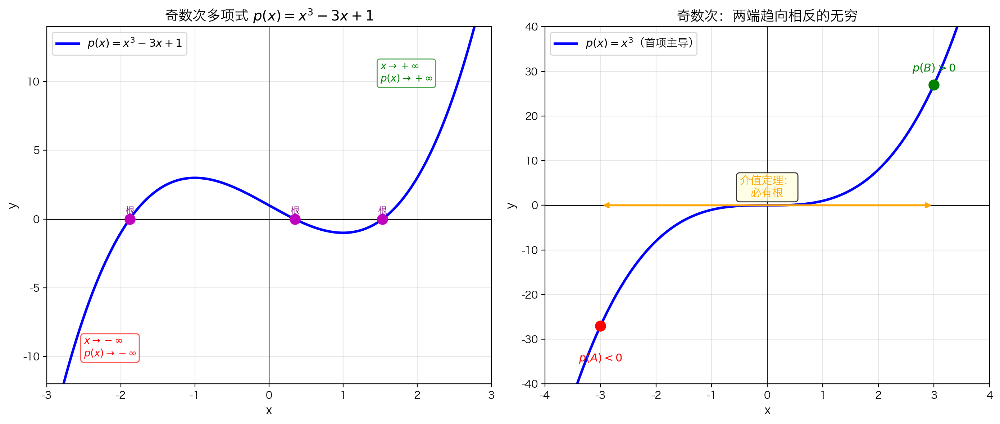
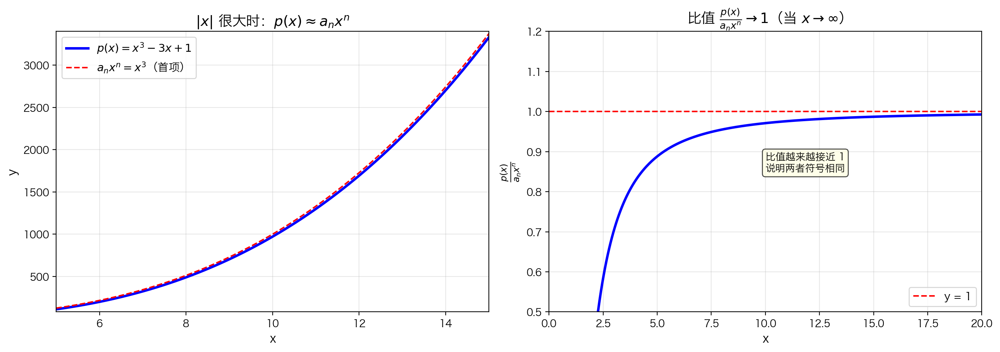
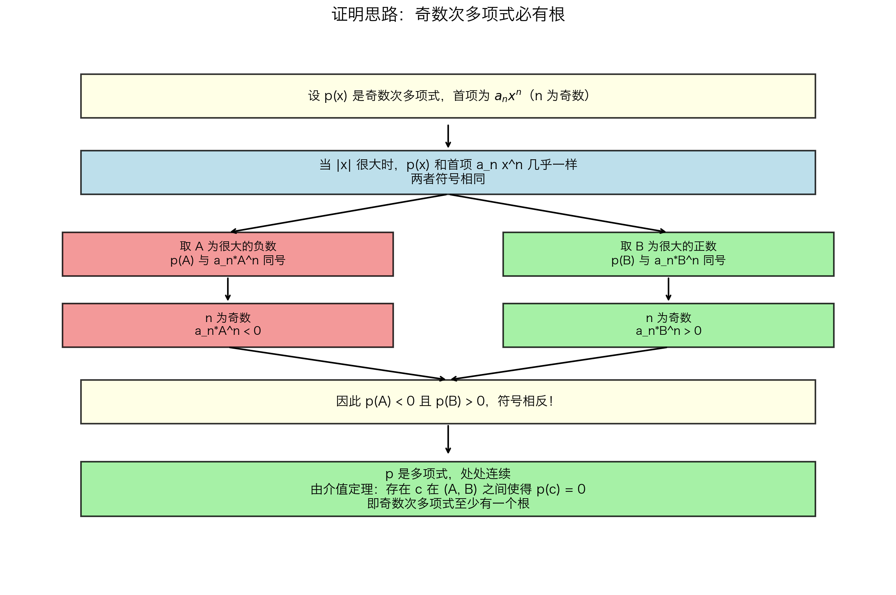

## 本节总览

[上一节](5.1.4%20介值定理.md)我们学会了介值定理：**连续函数从负到正，必然经过零**。这一定理看起来简单，却能证明一些非常深刻的结论。

这一节就用介值定理来证明一个漂亮的结论：

> **任意奇数次多项式，至少有一个实数根。**

也就是说，对于任何一个形如 $p(x) = a_n x^n + a_{n-1} x^{n-1} + \cdots + a_1 x + a_0$（其中 $n$ 为奇数）的多项式，总存在某个数 $c$，使得 $p(c) = 0$。

### 为什么奇数次很重要？

偶数次多项式**不一定**有根。例如 $x^2 + 1 = 0$ 就没有实数解（因为 $x^2 \geq 0$，所以 $x^2 + 1 \geq 1 > 0$）。

但奇数次 polynomial 总是至少有一个根——这背后的原因就是**介值定理**。

---

## 核心思想

### 一个观察

考虑最简单的奇数次多项式 $p(x) = x^3$：

- 当 $x \to +\infty$ 时，$p(x) \to +\infty$（往右上方走）
- 当 $x \to -\infty$ 时，$p(x) \to -\infty$（往左下方走）



**左图**：$p(x) = x^3 - 3x + 1$ 是一条"两头翘"的曲线——左边往下走，右边往上走。

**右图**：更简单的 $p(x) = x^3$。因为左端趋向 $-\infty$（负数），右端趋向 $+\infty$（正数），而曲线是连续不间断的，**必然**会在某处穿过 x 轴。

这就是介值定理的直觉：从负数连续走到正数，必然经过 0。

---

## 严格证明

### 第一步：当 $|x|$ 很大时，$p(x)$ 和它的首项几乎一样

对于多项式 $p(x) = a_n x^n + a_{n-1} x^{n-1} + \cdots + a_0$，当 $|x|$ 非常大时，**首项 $a_n x^n$ 主导了一切**。



**左图**：$p(x) = x^3 - 3x + 1$（蓝线）和它的首项 $x^3$（红线）。在 $x$ 很大的时候，两条线几乎重合。

**右图**：比值 $\frac{p(x)}{x^3}$ 随着 $x$ 增大趋近于 1。这说明 $p(x)$ 和 $x^3$ 不仅数值接近，**符号也相同**。

数学上，这是因为：

$$\lim_{x \to \infty} \frac{p(x)}{a_n x^n} = 1, \quad \lim_{x \to -\infty} \frac{p(x)}{a_n x^n} = 1$$

当比值趋近于 1（正数）时，分子和分母的符号必然相同——不可能一个为正、一个为负。

### 第二步：利用"奇数次"的关键性质

因为 $n$ 是**奇数**：

| | $x$ 是很大的负数 | $x$ 是很大的正数 |
|---|---|---|
| $x^n$ 的符号 | **负数** | **正数** |
| $a_n x^n$ 的符号 | 与 $a_n$ 相反 | 与 $a_n$ 相同 |
| $p(x)$ 的符号 | **与 $a_n x^n$ 相同** → **负数** | **与 $a_n x^n$ 相同** → **正数** |

**具体推导**：

1. 取 $A$ 为一个**很大的负数**，使得 $p(A)$ 与 $a_n A^n$ 同号
   - 由于 $n$ 是奇数，$A^n < 0$，所以 $a_n A^n$ 的符号与 $a_n$ 相反
   - 因此 $p(A)$ 的符号也与 $a_n$ 相反

2. 取 $B$ 为一个**很大的正数**，使得 $p(B)$ 与 $a_n B^n$ 同号
   - 由于 $n$ 是奇数，$B^n > 0$，所以 $a_n B^n$ 的符号与 $a_n$ 相同
   - 因此 $p(B)$ 的符号也与 $a_n$ 相同

3. 比较 $p(A)$ 和 $p(B)$：
   - $p(A)$ 的符号与 $a_n$ **相反**
   - $p(B)$ 的符号与 $a_n$ **相同**
   - 所以 $p(A)$ 和 $p(B)$ **符号相反**！

### 第三步：应用介值定理



现在我们有：

- $p$ 是多项式，所以**处处连续**
- $p(A)$ 和 $p(B)$ **一正一负**
- $A < B$

根据介值定理，在 $(A, B)$ 内必然存在某个 $c$，使得 $p(c) = 0$。

**证毕。**

---

## 为什么偶数次不行？

如果 $n$ 是**偶数**，上面的证明就失效了：

| | $x$ 是很大的负数 | $x$ 是很大的正数 |
|---|---|---|
| $x^n$ 的符号 | **正数**（偶次幂永远非负） | **正数** |
| $a_n x^n$ 的符号 | 与 $a_n$ **相同** | 与 $a_n$ **相同** |
| $p(x)$ 的符号 | 与 $a_n$ 相同 | 与 $a_n$ 相同 |

两端符号**相同**，介值定理的条件不满足。

例如 $p(x) = x^2 + 1$：
- $p(-100) = 10001 > 0$
- $p(100) = 10001 > 0$

两端都是正数，图像完全在 x 轴上方，自然没有根。

---

## 本节总结

### 核心结论

$$\text{奇数次多项式} \quad \Rightarrow \quad \text{至少有一个实数根}$$

### 证明的关键步骤

```
奇数次 → 首项 a_n x^n 在 x→-∞ 和 x→+∞ 时符号相反
      → p(x) 和首项在 |x| 很大时同号
      → p(A) < 0 且 p(B) > 0（A 很负，B 很正）
      → 介值定理 → 存在根 c
```

### 核心要点

| 要点 | 说明 |
|------|------|
| **首项主导** | $|x|$ 很大时，$p(x) \approx a_n x^n$ |
| **奇数次关键** | 正负无穷两端的首项符号相反 |
| **连续性** | 多项式处处连续，介值定理可用 |
| **存在性** | 至少一个根，可能有更多 |

### 常见误区

❌ **误区**："奇数次多项式恰好有一个根"

✅ **正解**：至少有一个根，但可以有多个。例如 $x^3 - x = x(x-1)(x+1)$ 有三个根：$-1, 0, 1$。

❌ **误区**："证明告诉我根在哪里"

✅ **正解**：证明只保证根**存在**，但不告诉我们具体位置。我们只知道根在某个很大的负数 $A$ 和很大的正数 $B$ 之间。
