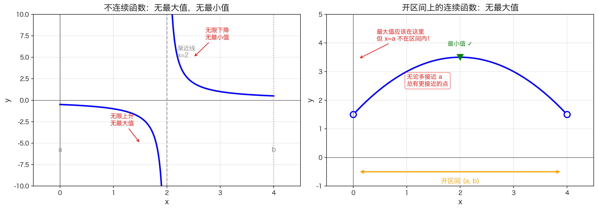
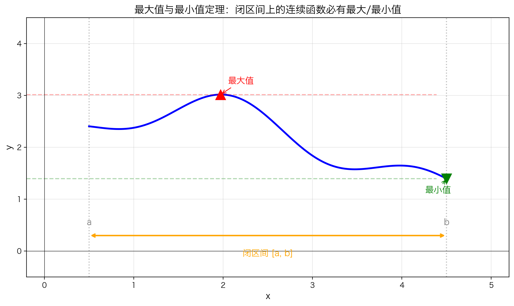

## 本节总览

[上一节](5.1.5%20奇数次多项式必有根.md)我们用介值定理证明了奇数次多项式必有根。介值定理讲的是连续函数"不漏掉中间值"，这一节来看连续性的另一个强大结论：

> **闭区间上的连续函数，一定有最大值和最小值。**

这就是**最大值与最小值定理**（Extreme Value Theorem，简称 EVT）。

### 本节知识结构

1. **直观理解**：为什么"一笔画"在闭区间上必然有最高点和最低点
2. **严格表述**：EVT 的数学语言
3. **两个前提缺一不可**：不连续或开区间都可能"找不到"最值
4. **最值可能出现的位置**：内部、端点、甚至每一点

---

## 直觉：闭区间上的连续函数

### 生活例子

想象你用手沿着一条连绵起伏的山路，从 $a$ 点走到 $b$ 点，全程不离开路面（连续），而且路的两端都有明确的标记（闭区间）。

**问：这段路上有没有最高点？有没有最低点？**

**答案：一定有。**

- 你不可能一直往上走不到头——因为路在 $b$ 点结束了
- 你也不可能一直往下走不到底——因为路在 $a$ 点开始了
- 这条路有头有尾、连绵不断，所以**必然存在某个最高点**，也**必然存在某个最低点**

> 这就是 EVT 的核心直觉：**有头有尾（闭区间）、连绵不断（连续）的曲线，一定有最高点和最低点。**

---

## 严格表述：最大值与最小值定理

### 定理

**如果**：

1. 函数 $f$ 在**闭区间** $[a, b]$ 上**连续**

**那么**：

- 至少存在一点 $c \in [a, b]$，使得 $f(c)$ 是**最大值**（$f(c)$ 是 $[a,b]$ 上所有函数值中最大的）
- 至少存在一点 $d \in [a, b]$，使得 $f(d)$ 是**最小值**（$f(d)$ 是 $[a,b]$ 上所有函数值中最小的）

用符号写就是：

$$\exists c, d \in [a, b], \quad f(c) = \max_{x \in [a, b]} f(x), \quad f(d) = \min_{x \in [a, b]} f(x)$$

> **符号说明**：$\exists$ 读作"存在"，是反写的字母 E（取自英文 **E**xist 的首字母）。$\exists c, d \in [a, b]$ 表示"至少存在 $c$ 和 $d$ 在区间 $[a, b]$ 内"。

---

## 最值可能出现的位置

最大值和最小值出现在哪里？不一定在内部！下面四种情况都满足 EVT：

### 情况 1：最值都在区间内部

**左上图**：最大值和最小值都出现在区间 $(a, b)$ 的某个内点上。

- 就像一座山，山顶和谷底都在山的中间部分
- 函数在那里是"峰"或"谷"，导数为零（后面会学）

### 情况 2：最值在端点

**右上图**：最小值恰好在左端点 $x = a$ 处取得，最大值在右端点 $x = b$ 处取得。

- 函数从 $a$ 到 $b$ 单调上升，起点最低、终点最高
- 这种情况很常见！所以搜索最值时不能只看内部，端点也要检查

### 情况 3：多个最值点

**左下图**：函数有两个最低点（$x = 0.5$ 和 $x = 3.5$），最大值在右端点 $x = b$ 处。

- EVT 只说"至少有一个"最值点，不保证唯一
- 可以有很多个点同时达到最小值或最大值

### 情况 4：常数函数

**右下图**：$f(x) = 2$（常数函数）。

- 每一点的函数值都相同
- 所以**每一点既是最大值点，也是最小值点**
- 这说明最值点有时不是唯一的，甚至可能"到处都是"

> **关键理解**：EVT 保证最值**存在**，但不告诉我们具体在哪里、有几个。

---

## 两个前提缺一不可

EVT 有两个关键前提，缺一不可：

| 前提 | 什么意思 | 缺少它的后果 |
|------|---------|------------|
| **闭区间** $[a, b]$ | 区间有明确的起点 $a$ 和终点 $b$ | 最值可能"漏掉"，无限接近端点但永远达不到 |
| **连续** | 图像一笔画出，中间不断开 | 最值可能"逃逸到无穷"，无限上升或无限下降 |

**结论**：两个条件同时满足 $\Rightarrow$ **最大值和最小值必然存在**

如果缺少任何一个，结论就可能不成立。

### 反例 1：不连续的函数

**左图**：$f(x) = \frac{1}{x-2}$ 在 $[0, 4]$ 上。

- 在 $x = 2$ 处有一条垂直渐近线，函数不连续
- 当 $x \to 2^-$ 时，$f(x) \to -\infty$（无限下降）
- 当 $x \to 2^+$ 时，$f(x) \to +\infty$（无限上升）
- **没有最小值**（可以无限小），**也没有最大值**（可以无限大）

> 连续性被破坏，最值就可能"逃逸到无穷"。

### 反例 2：开区间上的连续函数

**右图**：$f(x) = -\frac{1}{2}(x-2)^2 + 3.5$ 只在开区间 $(0, 4)$ 上定义。

- 函数在开区间上是连续的（一条完整的抛物线）
- **最小值存在**：在 $x = 2$ 处，函数值为 $3.5$
- **但最大值不存在！**
  - 最大值"应该"在 $x = 0$ 附近取得（函数值约为 $3.45$）
  - 但 $x = 0$ 不在区间 $(0, 4)$ 内！
  - 无论你取多接近 $0$ 的点，总有更接近的点函数值更大

> 开区间就像"没有围墙的院子"——函数值可以无限接近某个端点，但永远达不到。最值就可能"漏掉"。

---

## EVT 的核心图景

把条件凑齐，EVT 的结论是确定的：

**闭区间** $[a, b]$ + **连续** $\Rightarrow$ **必有最大值和最小值**

图中蓝色的连续曲线从 $a$ 画到 $b$，中间不中断。红色三角标记最高点，绿色倒三角标记最低点——它们一定存在，只是具体位置要看函数的形状。

---

## 为什么 EVT 很重要？

EVT 是一个**存在性定理**——它告诉你"最值一定存在"，但不告诉你具体在哪里。

这看起来好像没什么用，但实际上它是后面很多结论的基础：

- 想求一个函数的最大利润、最小成本？首先要知道最值**是否存在**——EVT 保证它存在
- 后面学习导数时，我们会用导数找"可疑点"，再结合 EVT 就能确定找到了真正的最值

没有 EVT 的保证，你就算算出了导数为零的点，也不敢确定那是不是真正的最大值或最小值。

---

## 本节总结

### 最大值与最小值定理（EVT）

$$f \text{ 在 } [a,b] \text{ 上连续} \quad \Rightarrow \quad \exists \text{ 最大值和最小值}$$

### 关键点

| 要点 | 说明 |
|------|------|
| **闭区间** | 必须是 $[a, b]$，不是 $(a, b)$ |
| **连续性** | 整个区间上不能断开 |
| **存在性** | 至少有一个最大值点、一个最小值点 |
| **不唯一** | 最值点可能有多个（甚至无穷多个） |
| **位置不定** | 最值可以在内部，也可以在端点 |

### 常见误区

❌ **误区**："最大值一定在区间内部"

✅ **正解**：最大值和最小值完全可能出现在**端点**处。例如单调递增函数，最小值在左端点，最大值在右端点。

❌ **误区**："开区间上的连续函数也有最值"

✅ **正解**：开区间没有端点，函数值可以无限接近边界但达不到。$f(x) = x$ 在 $(0, 1)$ 上没有最大值也没有最小值。

❌ **误区**："最值点是唯一的"

✅ **正解**：最值点可以有多个。常数函数的每一点都是最值点。

### 思考一个问题

假设函数 $f$ 在 $[0, 1]$ 上连续，且 $f(0) = 1$，$f(1) = 1$，中间在某点降到了 $f(0.5) = 0$。

**最大值在哪里？最小值又在哪里？**

> 提示：最大值不一定只有一个点哦。

---

## 下一节

EVT 告诉我们"最值一定存在"，但还不知道具体怎么找。接下来将学习**可导性**——连续性的"升级版"，它能帮我们精确找到最值点的位置。

→ [5.2 可导性](5.2%20可导性.md)
