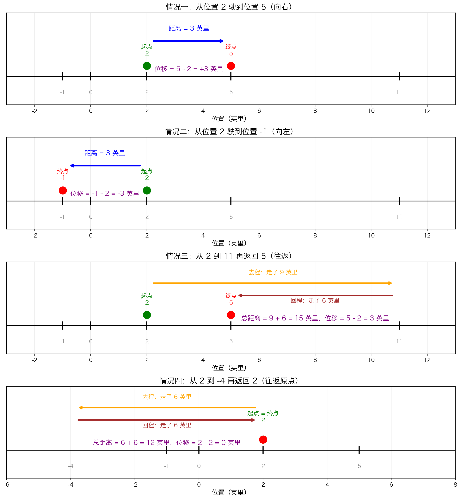

 ## 本节总览

[上一节](5.2%20可导性.md)我们知道了可导性是函数的另一种"光滑性"，灵感来自运动。这一节从物理直觉出发，一步步推导出**导数的核心公式**。

### 本节知识结构

1. **平均速率**：为什么"照片"无法告诉你速度
2. **位移与速度**：区分距离和位移，理解速度的正负
3. **瞬时速度**：用极限从"平均"逼近"瞬时"
4. **一个完整例子**：从位置函数求瞬时速度

---

## 平均速率：照片能告诉你什么？

### 问题的起点

想象在高速路上给一辆汽车拍照。曝光时间极短，图像清晰——你甚至看不出车在动。

**问：拍照时汽车的速度是多少？**

经典公式：

$$\text{速率} = \frac{\text{距离}}{\text{时间}}$$

但照片告诉你：
- **距离**：没有（车在照片里没动）
- **时间**：一瞬间（几乎为零）

所以你**无法回答**这个问题。

### 缩短时间间隔

好吧，我再告诉你一些信息：

| 已知信息 | 计算的平均速率 | 准确吗？ |
|---------|--------------|---------|
| 1 分钟走了 1 英里 | 60 英里/小时 | 不够——1 分钟里可能加速减速了很多次 |
| 10 秒走了 0.25 英里 | 90 英里/小时 | 好一些——但 10 秒里仍可能改变速率 |
| 1 秒走了 ... | 更接近 | 更好，但还不够精确 |
| 0.0001 秒走了 ... | 非常接近 | 几乎了，但严格来说仍不是"瞬时" |

**关键观察**：时间间隔越短，平均速率越接近拍照那一刻的真实速率。

> 这就是极限的用武之地——让时间间隔**趋近于零**，平均速率就趋近于**瞬时速率**。

---

## 位移与速度

### 距离 vs 位移

汽车在一条直路上行驶，路上有里程标志：

- **距离**：汽车实际走过的路程（总是正数）
- **位移**：终点位置 − 初始位置（可以是负数）

| 情况 | 距离 | 位移 |
|------|------|------|
| 从 2 驶到 5 | 3 英里 | $5 - 2 = 3$ 英里 |
| 从 2 驶到 −1 | 3 英里 | $-1 - 2 = -3$ 英里 |
| 从 2 走到 11 再返回 5 | 15 英里 | $5 - 2 = 3$ 英里 |
| 从 2 走到 −4 再返回 2 | 12 英里 | $2 - 2 = 0$ 英里 |



> 位移只关心起点和终点，不关心中间过程。距离则记录了全程。

### 平均速度

$$\text{平均速度} = \frac{\text{位移}}{\text{时间}}$$

- 速度可以是**负的**（向左行驶）
- 速率一定是**非负的**
- 如果汽车只朝一个方向行驶，平均速率 = 平均速度的绝对值

---

## 瞬时速度：从平均到瞬时

### 核心问题

**在某一瞬间，如何测量汽车的速度？**

### 思路

在拍照时刻 $t$ 之后，取一个越来越小的时间间隔，计算平均速度，然后取极限。

### 符号设定

- $t$：我们关心的时刻
- $u$：$t$ 之后很近的时刻
- $f(t)$：汽车在时刻 $t$ 的位置
- $v_{t \leftrightarrow u}$：从时刻 $t$ 到时刻 $u$ 的平均速度

现在就可以准确地计算平均速度 $v_{t \leftrightarrow u}$ 了：

$$v_{t \leftrightarrow u} = \frac{\text{在时刻 } u \text{ 的位置} - \text{在时刻 } t \text{ 的位置}}{u - t} = \frac{f(u) - f(t)}{u - t}$$

### 平均速度公式

$$v_{t \leftrightarrow u} = \frac{f(u) - f(t)}{u - t}$$

为什么分子是 $f(u) - f(t)$？因为这就是**位移**：

- $f(t)$：时刻 $t$ 的位置（初始位置）
- $f(u)$：时刻 $u$ 的位置（终点位置）
- $f(u) - f(t)$：位移（终点 − 起点）
- $u - t$：经过的时间（终点时刻 − 起始时刻）

所以 $\dfrac{f(u) - f(t)}{u - t} = \dfrac{\text{位移}}{\text{时间}} = \text{平均速度}$

### 取极限得到瞬时速度

让 $u$ 越来越靠近 $t$：

$$\text{在时刻 } t \text{ 的瞬时速度} = \lim_{u \to t} \frac{f(u) - f(t)}{u - t}$$

### 另一种写法

为什么需要另一种写法？因为用 $u$ 表示"另一个时刻"不够直观。我们换一个思路：用 $h$ 表示**时间间隔**。

**令 $h = u - t$**，也就是说 $h$ 是从 $t$ 到 $u$ 经过了多长时间。

那么反过来：$u = t + h$（终点时刻 = 起始时刻 + 时间间隔）

**代入过程**：

把 $u = t + h$ 代入公式中每个出现 $u$$的地方：

| 原来 | 代入后 | 为什么 |
|------|--------|--------|
| $f(u)$ | $f(t + h)$ | 因为 $u = t + h$ |
| $f(t)$ | $f(t)$ | 没有 $u$，不变 |
| $u - t$ | $(t + h) - t = h$ | 因为 $u = t + h$ |

所以：

$$\frac{f(u) - f(t)}{u - t} \quad \xrightarrow{u = t + h} \quad \frac{f(t + h) - f(t)}{h}$$

**极限的变化**：当 $u \to t$ 时，$h = u - t \to 0$

$$\text{在时刻 } t \text{ 的瞬时速度} = \lim_{h \to 0} \frac{f(t + h) - f(t)}{h}$$

### 用数字验证

假设 $f(t) = 15t^2 + 7$，在 $t = 3$ 处：

**准备**：先算出起点位置 $f(3) = 15 \times 9 + 7 = 142$

**公式 A**（$u$ 写法）：$\dfrac{f(u) - f(3)}{u - 3}$

**公式 B**（$h$ 写法）：$\dfrac{f(3 + h) - f(3)}{h}$

---

**当 $u = 4$，$h = 4 - 3 = 1$**：

- 公式 A：$\dfrac{f(4) - f(3)}{4 - 3} = \dfrac{(15 \times 16 + 7) - 142}{1} = \dfrac{247 - 142}{1} = \dfrac{105}{1} = 105$

- 公式 B：$\dfrac{f(3 + 1) - f(3)}{1} = \dfrac{f(4) - 142}{1} = \dfrac{247 - 142}{1} = \dfrac{105}{1} = 105$ ✓

---

**当 $u = 3.1$，$h = 3.1 - 3 = 0.1$**：

- 公式 A：$\dfrac{f(3.1) - f(3)}{3.1 - 3} = \dfrac{(15 \times 9.61 + 7) - 142}{0.1} = \dfrac{151.15 - 142}{0.1} = \dfrac{9.15}{0.1} = 91.5$

- 公式 B：$\dfrac{f(3 + 0.1) - f(3)}{0.1} = \dfrac{f(3.1) - 142}{0.1} = \dfrac{151.15 - 142}{0.1} = \dfrac{9.15}{0.1} = 91.5$ ✓

---

**当 $u = 3.01$，$h = 3.01 - 3 = 0.01$**：

- 公式 A：$\dfrac{f(3.01) - f(3)}{3.01 - 3} = \dfrac{(15 \times 9.0601 + 7) - 142}{0.01} = \dfrac{142.9015 - 142}{0.01} = \dfrac{0.9015}{0.01} = 90.15$

- 公式 B：$\dfrac{f(3 + 0.01) - f(3)}{0.01} = \dfrac{f(3.01) - 142}{0.01} = \dfrac{142.9015 - 142}{0.01} = \dfrac{0.9015}{0.01} = 90.15$ ✓

---

**当 $u = 3.001$，$h = 3.001 - 3 = 0.001$**：

- 公式 A：$\dfrac{f(3.001) - f(3)}{3.001 - 3} = \dfrac{(15 \times 9.006001 + 7) - 142}{0.001} = \dfrac{142.090015 - 142}{0.001} = \dfrac{0.090015}{0.001} = 90.015$

- 公式 B：$\dfrac{f(3 + 0.001) - f(3)}{0.001} = \dfrac{f(3.001) - 142}{0.001} = \dfrac{142.090015 - 142}{0.001} = \dfrac{0.090015}{0.001} = 90.015$ ✓

---

### 汇总观察

| $u$ | $h$ | 平均速度（两种公式结果相同） | 趋势 |
|-----|-----|--------------------------|------|
| 4 | 1 | 105 | |
| 3.1 | 0.1 | 91.5 | |
| 3.01 | 0.01 | 90.15 | |
| 3.001 | 0.001 | 90.015 | $\searrow$ |
| $\to 3$ | $\to 0$ | $\to 90$ | **瞬时速度** |

> **观察**：$h$ 越小，平均速度越接近 **90**。而 $90 = 30 \times 3$，正好是前面例子中瞬时速度公式 $30t$ 在 $t = 3$ 处的值。这验证了我们的计算是对的。

> **为什么要换？** $u$ 写法需要同时记住 $t$ 和 $u$ 两个时刻；$h$ 写法只需要关注"经过了多久"一个变量，更简洁。本质上就是**换元**：用 $h = u - t$ 替换了 $u$。

> **这就是导数的定义！** 瞬时速度就是位置函数的导数。

---

## 一个完整例子

### 问题

汽车从 7 英里标志处出发，在时刻 $t$（小时）的位置是：

$$f(t) = 15t^2 + 7$$

求汽车在任意时刻 $t$ 的瞬时速度。

### 题目分析

#### 物理背景

- 路上有里程标志（像高速路的里程碑），汽车**起点**在 7 英里标志处
- $f(t)$ 告诉你：**在时刻 $t$，汽车在哪个位置**

#### 拆解公式

$$f(t) = \underbrace{15t^2}_{\text{走了多远}} + \underbrace{7}_{\text{起点位置}}$$

| 部分 | 含义 | 验证 |
|------|------|------|
| $7$ | 起点位置（7 英里标志处） | $f(0) = 15 \times 0 + 7 = 7$（$t=0$ 时在 7 英里处） ✓ |
| $15t^2$ | 从起点开始**走了多远** | 随时间增大，走得越来越多 |

#### 代入几个时刻

| 时刻 $t$（小时） | $15t^2$（走了多远） | $f(t) = 15t^2 + 7$（实际位置） |
|:-:|:-:|:-:|
| 0 | $15 \times 0 = 0$ | $0 + 7 = 7$ 英里（起点） |
| 0.5 | $15 \times 0.25 = 3.75$ | $3.75 + 7 = 10.75$ 英里 |
| 1 | $15 \times 1 = 15$ | $15 + 7 = 22$ 英里 |
| 2 | $15 \times 4 = 60$ | $60 + 7 = 67$ 英里 |
| 3 | $15 \times 9 = 135$ | $135 + 7 = 142$ 英里 |

#### 为什么是 $t^2$ 而不是 $t$？

如果位置是 $f(t) = 60t + 7$（一次函数），说明汽车**匀速行驶**——每小时走 60 英里，永远不变。

但这里是 $f(t) = 15t^2 + 7$（二次函数），说明汽车在**加速**：

- 第一个小时：从 7 走到 22，走了 **15** 英里
- 第二个小时：从 22 走到 67，走了 **45** 英里
- 第三个小时：从 67 走到 142，走了 **75** 英里

每小时走的距离**越来越大**——这就是加速。所以不存在一个固定的"每小时走多少英里"，速度一直在变，必须用导数来求**瞬时速度**。

#### 这道题在问什么？

> "求汽车在任意时刻 $t$ 的瞬时速度"

翻译：**在每一个瞬间，汽车跑得有多快？**

因为速度一直在变，所以答案不是一个数字，而是一个**关于 $t$ 的公式**。

### 解题步骤

**第一步**：写出公式

$$\text{瞬时速度} = \lim_{h \to 0} \frac{f(t + h) - f(t)}{h}$$

**第二步**：代入 $f(t) = 15t^2 + 7$

公式里有两处需要代入：$f(t + h)$ 和 $f(t)$。分别计算：

- **$f(t + h)$**：把 $f(t)$ 里每个 $t$ 都替换成 $(t + h)$

$$f(t + h) = 15(t + h)^2 + 7$$

> 怎么替换？$f(t) = 15\boldsymbol{t}^2 + 7$，把 $\boldsymbol{t}$ 换成 $\boldsymbol{(t + h)}$，就得到 $15\boldsymbol{(t+h)}^2 + 7$

- **$f(t)$**：就是原函数本身，不用改

$$f(t) = 15t^2 + 7$$

- **代入公式**：分子 $= f(t+h) - f(t)$

$$= \lim_{h \to 0} \frac{[15(t + h)^2 + 7] - [15t^2 + 7]}{h}$$

> 注意：$f(t+h)$ 是"终点位置"，$f(t)$ 是"起点位置"，两者相减就是**位移**。

**第三步**：展开 $(t + h)^2 = t^2 + 2th + h^2$

$$= \lim_{h \to 0} \frac{15t^2 + 30th + 15h^2 + 7 - 15t^2 - 7}{h}$$

**第四步**：化简

$$= \lim_{h \to 0} \frac{30th + 15h^2}{h} = \lim_{h \to 0} (30t + 15h)$$

**第五步**：消去 $h$（关键一步！$h$ 是造成 $0/0$ 的元凶），代入 $h = 0$

$$= 30t$$

### 结论

在时刻 $t$ 的瞬时速度 $= 30t$（英里/小时）

| 时刻 | 速度 |
|------|------|
| $t = 0$ | $30 \times 0 = 0$ 英里/小时（静止） |
| $t = 0.5$ | $30 \times 0.5 = 15$ 英里/小时 |
| $t = 1$ | $30 \times 1 = 30$ 英里/小时 |

> 汽车每小时速度增加 30 英里/小时，即以 **30 英里/小时²** 加速。注意 $30 = 2 \times 15$——位置函数中 $t^2$ 的系数 15，和速度中 $t$ 的系数 30 之间是**2 倍关系**。这不是巧合，后面学了求导法则就自然明白了。

---

## 本节总结

### 三个核心公式

| 概念 | 公式 | 含义 |
|------|------|------|
| 平均速度 | $\dfrac{f(u) - f(t)}{u - t}$ | 一段时间内的平均快慢 |
| 瞬时速度（写法1） | $\displaystyle\lim_{u \to t} \frac{f(u) - f(t)}{u - t}$ | 某一时刻的精确快慢 |
| 瞬时速度（写法2） | $\displaystyle\lim_{h \to 0} \frac{f(t + h) - f(t)}{h}$ | 等价写法，用 $h$ 表示时间间隔 |

### 核心思路

```
照片无法告诉你速度
    ↓ 缩短时间间隔
平均速度越来越接近真实速度
    ↓ 取极限（间隔 → 0）
瞬时速度 = 导数
```

### 关键理解

- **导数的本质**：函数在某一点的瞬时变化率
- **物理直觉**：瞬时速度 = 位置函数的导数
- **计算方法**：先写出 $\dfrac{f(t+h) - f(t)}{h}$，化简消去 $h$，再令 $h = 0$

---

## 下一节

瞬时速度的公式 $\displaystyle\lim_{h \to 0} \frac{f(t + h) - f(t)}{h}$ 就是**导数**的定义。下一节将正式给出导数的严格定义。

→ [5.2.2 导数的定义](5.2.2%20导数的定义.md)
